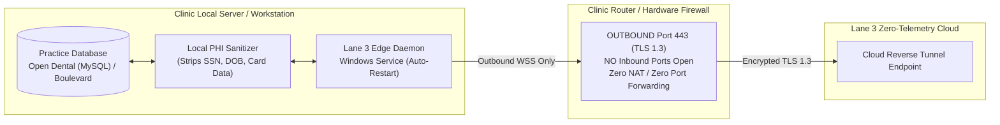

# Lane 3 One-Click Windows Clinic Edge Installer

Production deployment toolkit and IT Managed Service Provider (MSP) documentation for deploying the Lane 3 Edge Daemon on local clinic servers and workstations.

---

## 1. Security Architecture & MSP Pre-Flight

The #1 friction point when deploying software in outpatient dental and medical aesthetics clinics is the IT Managed Service Provider's security policy. 

Lane 3 is engineered from the ground up to satisfy the strictest enterprise IT compliance rules:



### MSP Security Verification Points:
- **Zero Inbound Firewall Open Ports**: The daemon establishes a secure, outbound-only WebSocket (WSS) over TLS 1.3 on standard port 443 (identical to web browser HTTPS traffic).
- **Local PHI Sanitization**: Social security numbers, full credit card numbers, and policy IDs are permanently stripped locally in RAM before any telemetry leaves the server.
- **Universal Hard Gate U-HG-02**: Contains zero third-party advertising trackers or tracking pixels.
- **Resource Footprint**: Consumes less than 45 MB of RAM and under 0.5% CPU during steady-state operation.

---

## 2. Quickstart Installation (3 Minutes)

### Step 1: Open Elevated PowerShell
On the clinic server or dedicated reception computer, open **PowerShell as Administrator**:
```powershell
Set-ExecutionPolicy -ExecutionPolicy RemoteSigned -Scope Process
```

### Step 2: Execute Automated Installer
Run the one-click installer script:
```powershell
.\installer\install_lane3_daemon.ps1 -InstallDir "C:\Lane3Edge" -ClinicId "PR-001" -ClinicName "Bellevue Aesthetic Medicine"
```

### Step 3: Run Interactive Configuration Wizard (Optional)
To update credentials or connect to Open Dental / Boulevard / Zenoti:
```powershell
python installer\config_wizard.py
```

The script will:
1. Validate local Python 3.10+ runtime.
2. Test outbound connectivity to port 443.
3. Build the folder hierarchy:
   - `C:\Lane3Edge\config\` (Encrypted `.env.clinic`)
   - `C:\Lane3Edge\data\` (Local queue & cache)
   - `C:\Lane3Edge\logs\` (Self-rotating log files)
   - `C:\Lane3Edgein\` (Startup launcher)
4. Register the Windows Scheduled Task / Service `Lane3EdgeDaemon` with automatic restart on boot and recovery upon failure.

---

## 3. Service Management & Troubleshooting

### Check Service Status
```powershell
Get-ScheduledTask -TaskName "Lane3EdgeDaemon"
```

### View Live Execution Logs
```powershell
Get-Content -Path "C:\Lane3Edge\logs\daemon.log" -Tail 50 -Wait
```

### Manual Test Run
```powershell
python -m edge_connector.connector_daemon --config "C:\Lane3Edge\config\.env.clinic"
```

### Uninstallation
To completely remove the service and binaries:
```powershell
Unregister-ScheduledTask -TaskName "Lane3EdgeDaemon" -Confirm:$false
Remove-Item -Recurse -Force "C:\Lane3Edge"
```

---

## 4. IT MSP Support & Emergency Contacts

For direct assistance or custom network configuration:
- **Engineering Desk**: `director@lane3healthcare.com`
- **Direct Phone**: (206) 880-0477
- **Technical Security Whitepaper**: Available in `research/06_ZERO_PORT_TUNNEL_SECURITY_SPECIFICATION.md`
