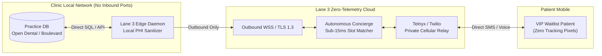

# Lane 3 Healthcare AI: Executive Overview & Founding Partner Opportunity

**The Autonomous, Zero-Port Infrastructure for Outpatient Dental & Aesthetic Practices**

---

### The Problem: Legacy SaaS Tolls, Broken Schedules, and Privacy Exposure

1. **The Compounding SaaS Toll**: Outpatient clinics pay **$1,800 to $2,500+ every month** to fragmented cloud aggregators (NexHealth, Weave, Podium, PatientPop). Practices are trapped paying per-provider and per-message charges on closed proprietary systems.
2. **Acute Cancellation Holes**: When a 90-minute high-ticket procedure cancels at 8:15 AM (a $1,200 Morpheus8 RF session or a $2,200 All-on-4 surgical consultation), front desk staff play phone tag. Over 75% of short-notice slots expire unfilled.
3. **Dormant Wallet Liabilities**: Aesthetic practices hold an average of **$29,400 in unspent Beauty Bank credits**, with 60+ dormant VIP members receiving zero personalized outreach.
4. **$50,120/Day Statutory Privacy Exposure**: Under the FTC Health Breach Notification Rule (16 CFR 318) and Washington My Health My Data Act (RCW 19.373), booking widgets running Meta/TikTok tracking pixels leak protected health intent to commercial data brokers without BAAs.

---

### The Solution: Lane 3 Open-Source Edge Daemon

Lane 3 connects directly to your practice management system (**Open Dental**, **Boulevard**, or **Zenoti**) via an outbound-only TLS 1.3 reverse tunnel that requires **zero inbound firewall open ports**.

#### Core Operational Capabilities:
- **Sub-15ms Cancellation Recovery**: The moment a cancellation hits your ledger, Lane 3 matches waiting patients by dual-resource availability (Provider + Laser Suite/Operatory) and dispatches private SMS offers. Slots refill autonomously in seconds.
- **Beauty Bank VIP Concierge**: Identifies dormant wallet credits ($300+ unspent for 60+ days) and re-engages VIP members with personalized, zero-PHI booking links.
- **Universal Hard Gate U-HG-02 (Zero Pixels)**: Completely eliminates client-side marketing trackers, insulating the practice from HHS OCR and FTC statutory penalties.
- **Zero-Port Security Architecture**: 100% compliant with clinic IT MSP security requirements. Operates entirely outbound via port 443 with end-to-end tokenization.

---

### Commercial Economics: The Lane 3 Advantage

| Feature / Metric | Legacy Healthcare SaaS (NexHealth / Weave / PatientPop) | Lane 3 Healthcare AI (Open Source Architecture) |
|:---|:---|:---|
| **Monthly Software Fee** | $1,800 – $2,500+ / month (compounding) | **$450 / month flat** (lifetime price lock) |
| **Annual Operating Cost** | $21,600 – $30,000+ / year | **$5,400 / year** (Save $16,200 – $24,600/yr) |
| **Inbound Firewall Ports** | Often requires open ports or vulnerable cloud relays | **Zero open inbound ports** (Outbound TLS 1.3 only) |
| **Patient Privacy & Pixels** | Injects Meta/Google trackers on booking funnels | **Universal Hard Gate U-HG-02** (100% pixel-free) |
| **Cancellation Fill Latency** | 45 – 90 minutes (manual front desk calls) | **Under 15 milliseconds** (automated instant fill) |
| **Data Ownership** | Vendor owns API middleware and patient telemetry | **Practice retains 100% proprietary data ownership** |

---

### The Q3 Founding Partner Program (Puget Sound Flagships)

We are selecting **two premier practices** in King/Snohomish County for our Q3 Founding Partner Cohort:

1. **Turnkey White-Glove Installation**: Complete edge daemon deployment, PMS schema mapping, and carrier setup in under 45 minutes with zero staff workflow friction.
2. **The 30-Day Milestone Guarantee**: If Lane 3 does not autonomously recover at least **5 cancelled appointments** or **$5,000 in clinical revenue** in your first 30 days, we refund 100% of the $2,000 onboarding fee immediately.
3. **Direct Engineering Access**: 24/7 priority support and custom procedure workflow tailoring from the primary system architects.

---

### Experience the Live Mobile Phone Demo Right Now

Test the autonomous concierge from your own iPhone:
- **Text `DEMO` to (206) 880-0477** to experience an instant 2-second slot claim.
- **Inspect Live Production Sandbox**: [https://webdemo-nine-zeta.vercel.app](https://webdemo-nine-zeta.vercel.app)
- **Review Pilot Agreement**: [Founding Partner Contract (Google Docs)](https://docs.google.com/document/d/13FfufRcOWL43UwHVvzv7Z7zsDpb7soAgbr0E4a33q3I/edit?usp=sharing)
- **Contact**: Kamilla | Lead Architect | (206) 880-0477 | `director@lane3healthcare.com`
