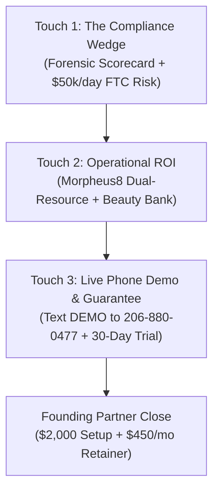

# Lane 3 Outreach & Business Development Suite

A structured, multi-channel client acquisition system designed for outpatient dental, plastic surgery, and medical aesthetics practices.

---

## 1. Executive Summary & Strategy

The Lane 3 business development workflow converts outpatient healthcare practices by leading with **statutory privacy compliance** as the initial wedge, demonstrating **quantifiable slot recovery ROI**, and closing with a **zero-risk milestone guarantee**.

---

## 2. Multi-Channel Cadence Timetable

| Day | Channel | Content / Focus | Primary Call to Action |
|:---|:---|:---|:---|
| **Day 1** | **Email Touch 1** | Confidential Privacy Scorecard & FTC HBNR liability warning | Review attached 1-page forensic scorecard |
| **Day 1** | **LinkedIn Connect** | Personalized connection note mentioning booking path privacy (<300 chars) | Accept connection |
| **Day 4** | **Email Touch 2** | Operational ROI: $1,200 Morpheus8 recovery + Beauty Bank reactivation | Request 10-minute live demonstration |
| **Day 5** | **LinkedIn InMail** | Executive summary of compliance audit + live phone concierge test link | Direct reply or text DEMO to (206) 880-0477 |
| **Day 8** | **Email Touch 3** | Founding Partner Pilot offer: 30-Day Milestone Guarantee | Text DEMO or book 10-min Zoom call |
| **Day 11** | **SMS Nudge** (Opt-in) | Executive follow-up: "Sent over the privacy audit and slot recovery..." | Reply YES for direct callback |

---

## 3. Objection Handling Battlecards

### Objection 1: *"We already use NexHealth / Weave / PatientPop and are satisfied."*
> **Response**: *"NexHealth and Weave are effective marketing communications tools, but practices pay a steep price: $1,800 to $2,500+ every single month in compounding fees. More importantly, when we audited regional practices this month, their booking widgets were actively leaking patient procedure selections to Meta and TikTok tracking pixels, creating acute $50k/day FTC liability. Lane 3 is an open-source local edge daemon that costs $450/month flat, eliminates pixel liability 100%, and recovers cancellations in under 5 milliseconds."*

### Objection 2: *"Our IT Managed Service Provider (MSP) does not allow third-party software on our server."*
> **Response**: *"That is exactly why we designed Lane 3 with a Zero-Port Security Architecture. The daemon requires zero inbound firewall open ports, runs entirely outbound over TLS 1.3 on port 443 (the exact same protocol your browser uses to access online banking), and strips all patient social security numbers, dates of birth, and payment card details locally before any telemetry reaches the cloud. We provide your MSP with a 2-page technical security brief and a 1-click verification script."*

### Objection 3: *"Is tracking really illegal? Our marketing agency installed Google Analytics to track ad conversions."*
> **Response**: *"Tracking general website visits on your homepage is permitted under AHA v. Becerra. However, the FTC Health Breach Notification Rule (16 CFR 318) and Washington My Health My Data Act (RCW 19.373) strictly prohibit transmitting identifiable patient intent—such as selecting 'Morpheus8 RF', 'Botox', or 'Dental Implants' on an appointment booking page—to platforms like Meta or Google without a signed Business Associate Agreement (which ad networks refuse to sign). Our scorecard shows the exact network beacons firing on your current booking path."*

### Objection 4: *"Why wouldn't we just stick with our software's built-in waitlist feature?"*
> **Response**: *"PMS waitlists are passive registries that require your front desk staff to manually notice an opening, pick up the telephone, and play phone tag while the schedule remains empty. When an 8:15 AM Morpheus8 slot cancels, front desk staff are greeting morning patients and cannot make 15 calls. Lane 3 detects the cancellation in under 5 milliseconds, verifies laser suite and injector availability simultaneously, and sends private SMS offers to your top waitlist candidates automatically."*

---

## 4. Live Mobile Demonstration Protocol (The 10-Minute Call)

When speaking with a clinic owner or practice manager, execute the **10-Minute Live iPhone Verification**:

1. **Step 1 (Minute 0-2)**: Open the call by confirming receipt of their 1-page Forensic Privacy Scorecard. Point out the exact tracking beacons detected on their scheduling URL.
2. **Step 2 (Minute 2-5)**: Walk through Slide 11 and Slide 12 of the Commercial Offering Deck, showing how dual-resource scheduling prevents laser suite conflicts and how Beauty Bank concierge reactivates dormant wallet credits.
3. **Step 3 (Minute 5-8)**: Instruct the prospect: *"Take out your cell phone right now and text **DEMO** to **(206) 880-0477**."* 
   - They receive an immediate, professional SMS response presenting a simulated opening for their flagship treatment.
   - They reply **`YES`**, and within 2 seconds receive an automated confirmation locking the provider and operatory.
4. **Step 4 (Minute 8-10)**: Present the **Founding Partner Agreement**:
   - $2,000 Setup Fee.
   - $450/month lifetime price lock.
   - **30-Day Milestone Guarantee**: 100% refund if the agent does not recover at least 5 cancellations or $5,000 in revenue in 30 days.

---

## 5. Assets & Collateral Reference

- **Campaign Templates Engine**: [`outreach/campaign_templates.py`](campaign_templates.py)
- **Top 5 Flagship Target Dossiers**: [`outreach/FLAGSHIP_PROSPECT_DOSSIERS.md`](FLAGSHIP_PROSPECT_DOSSIERS.md)
- **Executive One-Pager (Markdown)**: [`outreach/EXECUTIVE_ONE_PAGER.md`](EXECUTIVE_ONE_PAGER.md)
- **Executive One-Pager (Printable HTML)**: [`outreach/executive_one_pager.html`](executive_one_pager.html)
- **12-Slide Commercial Pitch Deck**: [Google Slides Presentation](https://docs.google.com/presentation/d/1LQv6MuuucE_LRDJ85z3u9DlnBD0oe1k48izzRFnDEio/edit?usp=sharing)
- **Founding Partner Agreement**: [Google Docs Contract](https://docs.google.com/document/d/13FfufRcOWL43UwHVvzv7Z7zsDpb7soAgbr0E4a33q3I/edit?usp=sharing)
