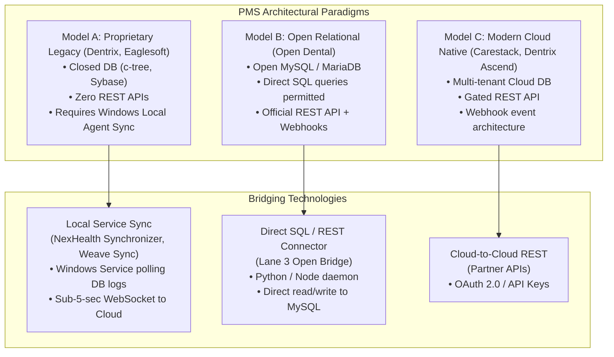
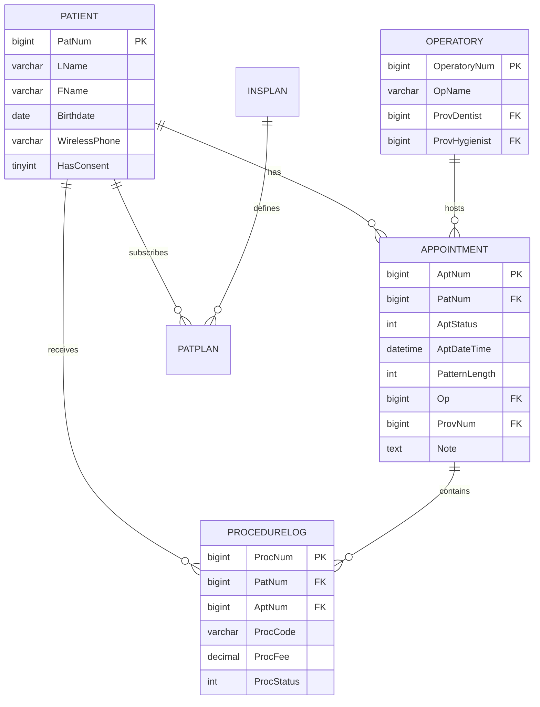
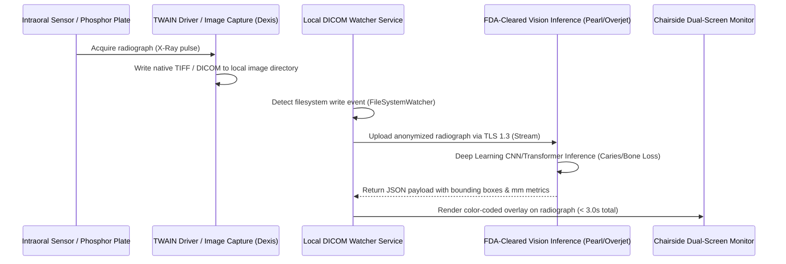

# 02 Technical Architecture & API Integration Study

## Executive Summary

Independent dental and outpatient medical practices face an architectural crisis known as the **"PMS Walled Garden"**. Core clinical systems—dating back to client-server architectures built in the 1990s and early 2000s (Dentrix on FairCom c-tree, Eaglesoft on Sybase/SAP SQL Anywhere, Open Dental on MySQL)—either lack open cloud APIs or charge third-party developers between $100 and $500/month per practice to unlock REST access.

This technical study reverse-engineers the mechanisms of:
1. **Local Synchronization Engines** (NexHealth, Weave) that bridge legacy databases to the cloud.
2. **Open Dental's Relational Schema** (the premier open-architecture target for Lane 3 automation).
3. **Radiographic Computer Vision Pipelines** (DICOM sensor bridges used by Pearl and Overjet).
4. **Ambient Scribing Injection Mechanics** (DOM injection, clipboard emulation, and direct REST insertion).

---

## 1. The Anatomy of PMS Integration Models



### 1.1 Model A: The Reverse-Engineered Sync Engine (NexHealth Model)
To connect with closed legacy databases (Dentrix G4–G7 and Eaglesoft), commercial PRM vendors deploy a lightweight Windows background service (`NexHealthSynchronizer.exe` or `WeaveSyncService.exe`) installed on the practice's main server:
1. **Transaction Log Sniffing**: The agent monitors the local database file modification timestamps (e.g. `DENTRIX.DAT` or Eaglesoft transaction logs).
2. **Read Port Polling**: It establishes a read-only ODBC or low-level file handle to query modified rows every 1 to 5 seconds.
3. **Encrypted WebSocket Transport**: Incremental diffs (new appointments, status changes, patient check-ins) are pushed over an outbound TLS 1.3 WebSocket connection to the vendor's cloud server.
4. **Writeback Mechanics**: For appointment writes or cancellations, the agent acquires an exclusive write lock or simulates a direct client insertion via proprietary protocol drivers.

---

## 2. Open Dental: Database Schema & Query Patterns (The Open Benchmark)

Open Dental is built on MySQL / MariaDB. The schema is completely documented, non-encrypted, and open to direct SQL queries. For Lane 3 agentic development, Open Dental represents the most accessible, high-performance foundation.

### 2.1 Core Relational Tables



### 2.2 Critical Open Dental SQL Queries for Agentic Workflows

#### Query 1: Real-Time Detection of Sudden Schedule Openings (Cancellations)
*Used by the Autonomous Scheduling Agent to detect open chairs within 30 seconds.*

```sql
SELECT 
    a.AptNum,
    a.PatNum,
    p.FName,
    p.LName,
    p.WirelessPhone,
    a.AptDateTime,
    a.PatternLength * 5 AS DurationMinutes,
    o.OpName,
    a.ProvNum
FROM appointment a
JOIN patient p ON a.PatNum = p.PatNum
JOIN operatory o ON a.Op = o.OperatoryNum
WHERE a.AptStatus = 5 -- Status 5 = Broken / Cancelled Appointment
  AND a.AptDateTime >= NOW()
  AND a.AptDateTime <= DATE_ADD(NOW(), INTERVAL 7 DAY)
  AND a.AptNum NOT IN (SELECT AptNum FROM custom_agent_processed_log)
ORDER BY a.AptDateTime ASC;
```

#### Query 2: Finding Priority Unscheduled Recall Patients Matching Chair Duration
*Matches hygiene recall patients who are overdue for a cleaning (D1110) matching the open operatory slot.*

```sql
SELECT 
    r.PatNum,
    p.FName,
    p.LName,
    p.WirelessPhone,
    r.DateDue,
    DATEDIFF(NOW(), r.DateDue) AS DaysOverdue,
    p.PreferSMS
FROM recall r
JOIN patient p ON r.PatNum = p.PatNum
LEFT JOIN appointment a ON r.PatNum = a.PatNum AND a.AptDateTime > NOW()
WHERE r.RecallTypeNum = 1 -- Type 1 = Routine Hygiene Recall
  AND r.DateDue <= NOW()
  AND a.AptNum IS NULL -- Patient has NO future appointment scheduled
  AND p.PatStatus = 0 -- Active Patient
  AND p.WirelessPhone != ''
  AND p.PreferSMS = 1 -- Has opted in to text communications
ORDER BY r.DateDue ASC
LIMIT 10;
```

#### Query 3: Inserting an Autonomous Booking into Open Dental
*Atomically claims the open slot when a waitlist patient confirms via SMS.*

```sql
INSERT INTO appointment (
    PatNum,
    AptStatus,
    Pattern,
    AptDateTime,
    Op,
    ProvNum,
    Note,
    IsNewPatient
) VALUES (
    10492, -- PatNum
    1, -- Status 1 = Scheduled
    'XXXX//XXXX', -- 50-minute pattern (5 min per X)
    '2026-09-12 10:00:00',
    2, -- Operatory 2 (Hygiene Chair)
    4, -- Provider Number (Hygienist)
    'Auto-booked by Agent Waitlist Auto-Fill via SMS confirmation at 2026-09-09 16:42:10 UTC',
    0
);
```

---

## 3. Radiographic Computer Vision & Sensor Bridging (Pearl / Overjet Architecture)

Diagnostic AI tools cannot rely on slow manual file uploads. They must integrate seamlessly into operatory workstations:



### 3.1 Radiographic Inference Payload Format
Below is the verified schema structure returned by leading dental vision engines:

```json
{
  "inferenceId": "inf_98234a9f",
  "patientId": "anon_pat_4812",
  "radiographType": "BITEWING",
  "toothIdentified": [
    {
      "toothNumberADA": "19",
      "findings": [
        {
          "type": "CARIES",
          "surface": "DISTAL",
          "depth": "DENTIN_ENAMEL_JUNCTION",
          "confidence": 0.94,
          "boundingBox": [412, 680, 520, 790]
        },
        {
          "type": "ALVEOLAR_BONE_LOSS",
          "mesialBoneLossMm": 4.6,
          "distalBoneLossMm": 3.8,
          "confidence": 0.89,
          "proposedPerioStage": "STAGE_II_GRADE_B"
        }
      ]
    }
  ],
  "algorithmicProposals": [
    {
      "cdtCode": "D4341",
      "description": "Periodontal scaling and root planing - four or more teeth per quadrant",
      "quadrant": "LL",
      "rationale": "Bone loss exceeds 4.0mm threshold on tooth #19 with calculus detection."
    }
  ]
}
```

---

## 4. Ambient Clinical Scribing & EHR Injection Architecture

Ambient AI documentation tools (Nabla, Heidi Health, Bola AI) operate across four technical layers:

1. **Local Audio Capture & Transport**:
   - Ambient operatory microphone (Jabra speak or workstation mic) captures 16kHz linear PCM audio.
   - Chunked into 5-second buffers and streamed over TLS 1.3 WebSockets.
   - Zero-storage policy: Audio is held in volatile memory (RAM) and flushed immediately upon ASR finalization.

2. **ASR & Acoustic Medical Fine-Tuning**:
   - Audio is transcribed using models specialized in medical/dental nomenclature (handling terms like *subgingival curettage*, *mesio-occlusal composite*, *periapical radiolucency*).

3. **Prompt Structuring & CDT Extraction**:
   - The transcript is processed by an LLM instructed to extract:
     - **Subjective**: Patient chief complaint and dental history updates.
     - **Objective**: Probing pocket depths (e.g. `3-2-3, 4-4-5`), restorations needed, tooth numbers.
     - **Assessment**: Caries diagnosis, periodontal staging.
     - **Plan**: Propose treatment codes and postoperative instructions.

4. **PMS/EHR Injection Mechanics**:
   - *Method 1 (Chrome Extension / Webhook)*: For web-based EHRs (Tebra, CharmHealth, Dentrix Ascend), a browser extension inspects the active DOM, matches the field IDs (`#chart_notes`, `#subjective_input`), and simulates typing events.
   - *Method 2 (Windows Desktop Injection)*: For desktop PMS (Open Dental, Dentrix G7), a background desktop helper listens for a trigger hotkey (e.g. `Ctrl+Alt+V`), focuses the active Open Dental note text area via the Windows Accessibility API (`UIAutomationCore.dll`), and pastes the formatted note.
   - *Method 3 (Direct Database Staging)*: The agent inserts the note directly into `appointment.Note` or creates a record in `procnote` pending doctor digital signature.
