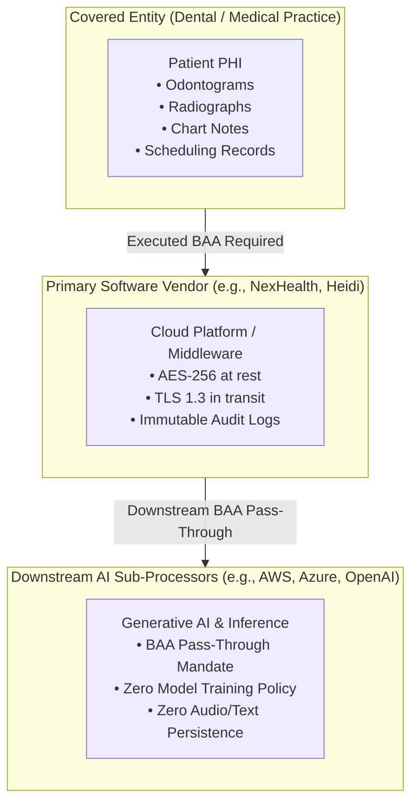
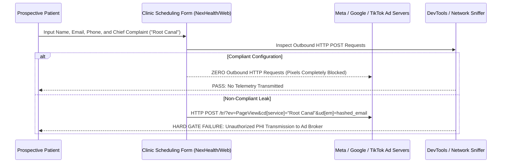

# 03 Regulatory Compliance & Legal Risk Audit

## Executive Summary

Deploying automated software agents, ambient voice scribes, computer vision diagnostics, and autonomous scheduling systems in outpatient healthcare introduces multi-layered legal liability. A technical error or misconfigured vendor contract can trigger HHS Office for Civil Rights (OCR) enforcement, Federal Trade Commission (FTC) civil penalties, Federal Communications Commission (FCC) statutory damages, or state consumer class-action lawsuits.

This report establishes the empirical audit criteria and statutory boundaries governing independent medical, dental, and medical spa software systems.

---

## 1. HIPAA / HITECH Compliance: The Business Associate Agreement (BAA) Standard

Under 45 CFR Part 160 and Part 164, any third-party software vendor that creates, receives, maintains, or transmits Protected Health Information (PHI) on behalf of a Covered Entity is classified as a **Business Associate (BA)**.



### 1.1 Non-Negotiable BAA Terms for AI Vendors
When auditing software candidates under Universal Hard Gate `U-HG-01`, practices must verify:
1. **Unconditional Execution**: The vendor must provide an executed, countersigned BAA *prior* to receiving any patient data. Standard consumer terms of service (e.g. standard ChatGPT, consumer Twilio, non-enterprise Zapier) explicitly violate federal law.
2. **Sub-Processor Pass-Through**: The BAA must legally bind all downstream infrastructure providers (e.g., AWS GovCloud, Google Cloud Platform, Microsoft Azure, OpenAI Enterprise) to identical privacy and security standards.
3. **Prohibition of Model Training on PHI**: The contract must feature an express, non-waivable restriction prohibiting the vendor or any downstream processor from utilizing identifiable or de-identified patient data, clinical audio recordings, transcripts, or radiographs to train public or proprietary foundational AI models.
4. **Data Purge Protocols**: Audio streams and temporary transcripts processed by ambient scribing engines must be flushed from volatile memory (RAM) immediately upon SOAP note generation.

---

## 2. The Website Tracking Pixel Crisis (OCR Guidance vs. AHA v. Becerra)

One of the most catastrophic compliance blind spots in outpatient healthcare is the deployment of third-party advertising tracking snippets (Meta Pixel, Google Tag Manager / GA4, TikTok SDK) on practice websites.

### 2.1 The Interplay of OCR Bulletins and Federal Case Law
- **HHS OCR Bulletin (Dec 2022 / March 2024)**: The OCR declared that tracking technologies capturing an individual's IP address and browsing history on a healthcare website (e.g. visiting a page titled `/dental-implants` or `/botox-consultation`) constitutes an unauthorized disclosure of PHI.
- **AHA v. Becerra Ruling (U.S. District Court, Northern District of Texas, June 2024)**: The federal court partially vacated the OCR's guidance regarding *unauthenticated public webpages*, ruling that an unknown user's subjective browsing intent cannot convert non-identifiable web traffic into PHI.
- **The Critical Protected Boundary**: The court explicitly affirmed that **authenticated patient portals, appointment scheduling engines, and digital intake forms remain strictly protected PHI environments**.

### 2.2 Empirical Web Sniffer Audit Protocol
Practices must execute a network payload inspection on all online booking funnels:



#### Verification Snippet: Detecting Leaked Web Beacons (Playwright/Node)
```javascript
// Test script: Detecting unauthorized third-party trackers on patient scheduling URLs
const { chromium } = require('playwright');

(async () => {
  const browser = await chromium.launch();
  const page = await browser.newPage();
  
  const suspiciousHosts = ['facebook.net', 'google-analytics.com', 'tiktok.com', 'criteo.com'];
  const violations = [];

  page.on('request', request => {
    const url = request.url();
    for (const host of suspiciousHosts) {
      if (url.includes(host)) {
        violations.push({ host, url, method: request.method() });
      }
    }
  });

  await page.goto('https://practice-booking-widget-url.com');
  console.log(`Audit Complete. Violations Detected: ${violations.length}`);
  if (violations.length > 0) {
    console.error('FAILED U-HG-02: Tracking pixels detected in booking funnel!');
    console.table(violations);
  } else {
    console.log('PASSED U-HG-02: Zero third-party telemetry detected.');
  }
  await browser.close();
})();
```

---

## 3. FTC Act Section 5 & The Health Breach Notification Rule (HBNR)

Under its July 2024 final rule amendments, the FTC has aggressively expanded its regulatory authority over non-HIPAA health technology:
- **Direct-to-Consumer Coverage**: Aesthetic clinics, medical spas, and wellness centers operating on a cash-pay basis outside traditional insurance reimbursement are subject to FTC enforcement even if they fall outside traditional HIPAA covered entity status.
- **Deceptive Privacy Trade Practices**: Sharing customer booking inquiries or aesthetic treatment preferences with advertising brokers without explicit, affirmative, opt-in consent constitutes a deceptive practice under Section 5 of the FTC Act.
- **Enforcement Precedents**: Landmark FTC enforcement orders against digital health providers (GoodRx, BetterHelp, Cerebral, Monument) resulted in millions in civil penalties and permanent bans on sharing health data with Meta and Google.
- **Civil Penalties**: FTC penalties reach up to **$50,120 per violation per day**.

---

## 4. TCPA & FCC 10DLC Telephony Compliance

Automated SMS messaging (appointment reminders, recall cadences, waitlist alerts) is strictly governed by the **Telephone Consumer Protection Act (47 U.S.C. § 227)** and cellular carrier **10-Digit Long Code (10DLC)** regulations:

1. **Consent Differentiation**:
   - *Transactional Reminders*: Enjoy limited statutory exemptions under HIPAA for direct appointment confirmation, provided no marketing content is included.
   - *Marketing & Recall Alerts*: Require explicit, verifiable **Prior Express Written Consent** captured via paper or digital signature.
2. **Mandatory Keyword Suppression**:
   - The messaging platform must hard-code automated recognition of standard opt-out keywords: `STOP`, `UNSUBSCRIBE`, `CANCEL`, `QUIT`, `END`.
   - Upon receiving an opt-out, the system must immediately suppress all automated outbound dispatches across all modules (waitlist, recall, marketing) and log the revocation timestamp.
3. **Carrier 10DLC Brand Vetting**:
   - Unregistered local numbers are subject to aggressive carrier filtering and per-message surcharges by AT&T and T-Mobile. Practices must register their legal EIN and campaign use-cases with The Campaign Registry (TCR).
4. **Statutory Damages**: TCPA statutory damages range from **$500 to $1,500 per unauthorized message**.

---

## 5. State Biometric & Consumer Health Privacy (Washington MHMDA & Nevada SB 370)

The enactment of the **Washington My Health My Data Act (MHMDA - HB 1155)** and Nevada SB 370 represents a massive legal risk for aesthetic medicine and medical spas:

| Regulatory Dimension | Traditional HIPAA Standard | Washington MHMDA / Nevada SB 370 Standard |
|---|---|---|
| **Scope of Covered Data** | Protected Health Information (PHI) held by Covered Entities. | Any consumer health data that identifies past, present, or future physical/mental health, including biometric data and aesthetic treatment logs. |
| **Aesthetic / Cash-Pay Application**| Frequently ambiguous for non-covered cash-pay services. | **Strictly Applicable** to all commercial aesthetic clinics and wellness centers. |
| **Facial Photograph Consents** | Standard HIPAA release form. | **Separate, Standalone Affirmative Opt-In Consent** required prior to collection and sharing. |
| **Geofencing Prohibitions** | No explicit geofencing rules. | **Strictly Prohibits** establishing a virtual boundary within 1,750 feet of any healthcare or aesthetic facility. |
| **Enforcement Mechanism** | HHS OCR civil monetary penalties; no private right of action. | **Enforced by State Attorney General AND Private Right of Action** (consumer class-action lawsuits). |

---

## 6. FDA Software as a Medical Device (SaMD) Classification

Under 21 CFR Part 820 and IEC 62304, diagnostic computer vision platforms (Pearl, Overjet, VideaHealth) are regulated as **Class II Medical Devices (Software as a Medical Device - SaMD)**.

### 6.1 The Legal Boundary: Clinical Decision Support vs. Unauthorized Practice of Medicine
- **FDA 510(k) Indication for Use**: Dental AI systems are legally cleared solely as **diagnostic aids** to assist the practitioner in detecting potential pathology.
- **The Mandatory Human-in-the-Loop (HITL) Gate**: The AI system is legally prohibited from rendering an autonomous diagnosis, proposing an unverified treatment plan, or submitting insurance claims without human review.
- **Malpractice Liability Guardrail**: The licensed clinician retains exclusive, non-delegable legal liability for all clinical care presented to the patient. Software must enforce an immutable audit log recording the clinician's verification, modification, or rejection of each AI radiographic detection.
