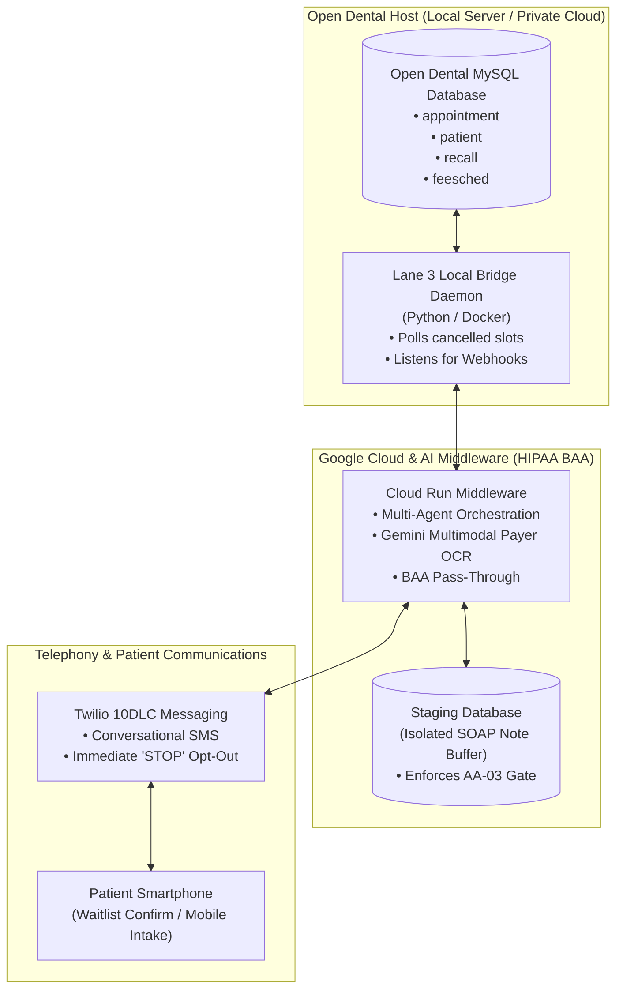

# 04 Lane 3 Agent-Native Bridge Specification

## 1. Architectural Vision & Business Case

### The Problem: The $2,000/Month 'Integration Tax'
A small independent dental practice attempting to modernize currently licenses 4 to 6 disconnected SaaS point solutions:
- Core Cloud PMS (Dentrix Ascend / Curve): $450–$700/mo
- PRM & 2-Way Texting (NexHealth / Weave): $350–$650/mo
- Diagnostic Computer Vision (Pearl / Overjet): $350–$600/mo
- Real-Time Payer Eligibility (Zuub / Zentist): $250–$500/mo
- Ambient AI Scribe (Bola / Heidi): $150–$300/mo
- **Total Monthly SaaS Burden: $1,550 to $2,750/month per practice**, plus setup fees and payment gateway markups.

### The Lane 3 Solution: The Open Google Workspace & Open Dental Bridge
Open Dental provides an open MySQL database and a fully documented relational schema. Google Workspace and Google Cloud Platform (GCP) provide an enterprise infrastructure covered by a standard signed BAA.

By engineering a lightweight, compliant, open-source middleware layer, a practice can:
1. Automate cancellation recovery and smart waitlist dispatch via Twilio 10DLC.
2. Ingest unstructured payer PDF fee schedules directly into Open Dental fee tables using Gemini Multimodal models.
3. Stage ambient clinical notes in an isolated buffer requiring clinician one-click sign-off (**AA-03 HITL Gate**).
4. Run for **under $80/month in total cloud and telephony operational expenses**.



## 2. Module A: Autonomous Schedule Recovery & Twilio Waitlist Engine

### 2.1 Workflow Logic
1. Daemon queries Open Dental every 60 seconds for newly created cancellations (`AptStatus = 5`).
2. Evaluates the cancelled slot: date, time, operatory, and duration (e.g. 50 minutes for hygiene).
3. Queries the `recall` table for active patients overdue for routine hygiene (`D1110`) who have given SMS consent.
4. Dispatches personalized SMS to the top 3 waitlist candidates.
5. Processes incoming replies: the first patient replying 'YES' is atomically booked into the chair; other candidates receive a polite update.
6. Handles TCPA opt-outs: any reply containing 'STOP' immediately revokes SMS consent in Open Dental (`PreferSMS = 0`).

### 2.2 Reference Implementation (Python / MySQL / Twilio)

```python
# Autonomous Schedule Recovery Daemon for Open Dental
# Complies with DOC-AA-01 AA-05 (Bounded Autonomous Execution)

import os
import time
import logging
from datetime import datetime, timedelta
import pymysql
from twilio.rest import Client

logging.basicConfig(level=logging.INFO, format="%(asctime)s [%(levelname)s] %(message)s")

DB_CONFIG = {
    "host": os.getenv("OD_DB_HOST", "127.0.0.1"),
    "user": os.getenv("OD_DB_USER", "root"),
    "password": os.getenv("OD_DB_PASS", ""),
    "database": os.getenv("OD_DB_NAME", "opendental"),
    "cursorclass": pymysql.cursors.DictCursor
}

TWILIO_ACCOUNT_SID = os.getenv("TWILIO_ACCOUNT_SID")
TWILIO_AUTH_TOKEN = os.getenv("TWILIO_AUTH_TOKEN")
TWILIO_PHONE = os.getenv("TWILIO_PHONE_NUMBER")
twilio_client = Client(TWILIO_ACCOUNT_SID, TWILIO_AUTH_TOKEN)

def get_db_connection():
    return pymysql.connect(**DB_CONFIG)

def detect_recent_cancellations(conn):
    with conn.cursor() as cursor:
        query = """
        SELECT a.AptNum, a.AptDateTime, a.Op, a.ProvNum, 
               (a.PatternLength * 5) as DurationMinutes, o.OpName
        FROM appointment a
        JOIN operatory o ON a.Op = o.OperatoryNum
        WHERE a.AptStatus = 5
          AND a.AptDateTime >= NOW()
          AND a.AptDateTime <= DATE_ADD(NOW(), INTERVAL 5 DAY)
          AND a.AptNum NOT IN (SELECT AptNum FROM custom_agent_log)
        ORDER BY a.AptDateTime ASC LIMIT 1;
        """
        cursor.execute(query)
        return cursor.fetchone()

def find_matched_waitlist_patients(conn, duration_minutes, limit=3):
    with conn.cursor() as cursor:
        query = """
        SELECT p.PatNum, p.FName, p.LName, p.WirelessPhone, r.DateDue
        FROM recall r
        JOIN patient p ON r.PatNum = p.PatNum
        LEFT JOIN appointment a ON r.PatNum = a.PatNum AND a.AptDateTime > NOW()
        WHERE r.RecallTypeNum = 1
          AND r.DateDue <= NOW()
          AND a.AptNum IS NULL
          AND p.PatStatus = 0
          AND p.WirelessPhone != ''
          AND p.PreferSMS = 1
        ORDER BY r.DateDue ASC
        LIMIT %s;
        """
        cursor.execute(query, (limit,))
        return cursor.fetchall()

def dispatch_waitlist_sms(patient, slot_datetime, duration_minutes):
    formatted_time = slot_datetime.strftime("%A, %b %d at %I:%M %p")
    message_body = (
        f"Hi {patient['FName']}, a dental hygiene opening just became available at our clinic on "
        f"{formatted_time} ({duration_minutes} mins). "
        f"Reply YES to claim this spot! Reply STOP to opt-out."
    )
    msg = twilio_client.messages.create(
        body=message_body,
        from_=TWILIO_PHONE,
        to=patient["WirelessPhone"]
    )
    logging.info(f"Dispatched waitlist SMS to PatNum {patient['PatNum']} (SID: {msg.sid})")
    return msg.sid
```

## 3. Module B: Payer PDF Fee Schedule Ingestion Engine (Gemini Multimodal)

### 3.1 Workflow Logic
1. Clinic uploads payer PDF benefit schedules (e.g., Delta Dental PPO Master Schedule) into a Google Drive drop-in folder.
2. A Cloud Function / Cloud Run service triggers upon file upload.
3. Multimodal Gemini extracts tabular procedure data, translating unstructured rows into standard CDT codes (`D0120`, `D1110`, `D4341`, `D2740`).
4. Extracts allowed copay amounts, maximum allowances, and frequency limitations.
5. Ingests structured fee items into Open Dental's `fee` table mapped to the specific `FeeSchedNum`.

### 3.2 Reference Implementation (Python / Gemini API)

```python
# Payer PDF Fee Schedule Extractor using Gemini Multimodal
# Ingests raw insurance PDFs directly into Open Dental Fee Tables

import os
import json
import google.generativeai as genai

genai.configure(api_key=os.getenv("GEMINI_API_KEY"))

EXTRACTION_PROMPT = """
You are an expert healthcare revenue cycle analyst. 
Analyze this dental insurance fee schedule PDF and extract all CDT procedure codes, 
descriptions, allowed amounts, and frequency limitations into clean JSON.

Output schema:
{
  "payerName": "string",
  "feeScheduleName": "string",
  "effectiveYear": 2026,
  "procedures": [
    {
      "cdtCode": "D0120",
      "description": "Periodic oral evaluation - established patient",
      "allowedFee": 48.00,
      "frequencyLimit": "Once every 6 months",
      "patientCoinsurancePercent": 0
    }
  ]
}
"""

def extract_fee_schedule_from_pdf(pdf_path):
    print(f"Uploading {pdf_path} to Gemini File API...")
    pdf_file = genai.upload_file(pdf_path, mime_type="application/pdf")
    model = genai.GenerativeModel(model_name="gemini-1.5-pro")
    response = model.generate_content(
        [pdf_file, EXTRACTION_PROMPT],
        generation_config={"response_mime_type": "application/json"}
    )
    data = json.loads(response.text)
    print(f"Successfully extracted {len(data.get('procedures', []))} procedure codes for {data.get('payerName')}.")
    return data

def update_open_dental_fees(conn, fee_data, feesched_num):
    with conn.cursor() as cursor:
        for proc in fee_data.get("procedures", []):
            code = proc.get("cdtCode")
            amount = proc.get("allowedFee")
            cursor.execute("SELECT CodeNum FROM procedurecode WHERE ProcCode = %s", (code,))
            row = cursor.fetchone()
            if row:
                code_num = row["CodeNum"]
                upsert_query = """
                INSERT INTO fee (Amount, FeeSched, CodeNum)
                VALUES (%s, %s, %s)
                ON DUPLICATE KEY UPDATE Amount = VALUES(Amount);
                """
                cursor.execute(upsert_query, (amount, feesched_num, code_num))
        conn.commit()
    print("Open Dental fee schedule updated successfully.")
```

## 4. Module C: Ambient Clinical Note Staging & Clinician Approval Interface

### 4.1 Enforcing the AA-03 Human Review Required Gate
In accordance with **DOC-AA-01 Agent Authority Specification**, an autonomous agent is **prohibited** from writing generative AI notes directly to the legal medical record (`appointment.Note` or `procnote`) without verified human authentication (**AAX-02 Prohibition**).

### 4.2 Staging & Review Architecture
1. **Ambient Recording**: Ambient audio is transcribed into structured dental SOAP note JSON.
2. **Staging Buffer**: Note is written to a temporary, non-operative staging table (`custom_agent_soap_staging`) with status `PENDING_REVIEW`.
3. **Clinician Web Portal / Operatory Widget**: A lightweight, authenticated web interface displays:
   - Extracted Subjective complaint
   - Objective findings (tooth numbers, perio depths)
   - Proposed CDT billing codes
   - Detected medical contraindications (e.g. 'Patient disclosed Eliquis - High Bleeding Risk')
4. **One-Click Commit**: Clinician clicks 'Approve & Commit'. Note is digitally signed and written to Open Dental.

### 4.3 Staging Table Schema (MySQL)
```sql
CREATE TABLE custom_agent_soap_staging (
    StagingId BIGINT AUTO_INCREMENT PRIMARY KEY,
    AptNum BIGINT NOT NULL,
    PatNum BIGINT NOT NULL,
    ProvNum BIGINT NOT NULL,
    SubjectiveText TEXT,
    ObjectiveText TEXT,
    AssessmentText TEXT,
    PlanText TEXT,
    ProposedCdtCodes JSON,
    FlaggedContraindications JSON,
    ReviewStatus ENUM('PENDING_REVIEW', 'APPROVED', 'MODIFIED', 'REJECTED') DEFAULT 'PENDING_REVIEW',
    ReviewedByProvNum BIGINT NULL,
    ReviewedAt DATETIME NULL,
    CreatedAt DATETIME DEFAULT CURRENT_TIMESTAMP
);
```

### 4.4 Commit Handler (Committing to Legal Medical Chart)
```python
def commit_staging_note_to_open_dental(conn, staging_id, approving_prov_num):
    with conn.cursor() as cursor:
        cursor.execute("SELECT * FROM custom_agent_soap_staging WHERE StagingId = %s", (staging_id,))
        note = cursor.fetchone()
        if not note or note["ReviewStatus"] != "PENDING_REVIEW":
            raise ValueError("Invalid staging record or already processed.")
        
        legal_note_text = (
            f"=== CLINICAL NOTE (Verified by Provider #{approving_prov_num}) ===\n"
            f"SUBJECTIVE: {note['SubjectiveText']}\n"
            f"OBJECTIVE: {note['ObjectiveText']}\n"
            f"ASSESSMENT: {note['AssessmentText']}\n"
            f"PLAN: {note['PlanText']}\n"
            f"Signed digitally at {datetime.utcnow().isoformat()} UTC."
        )
        
        cursor.execute("""
            UPDATE appointment 
            SET Note = CONCAT(IFNULL(Note, ''), '\n', %s),
                AptStatus = 2
            WHERE AptNum = %s;
        """, (legal_note_text, note["AptNum"]))
        
        cursor.execute("""
            UPDATE custom_agent_soap_staging
            SET ReviewStatus = 'APPROVED',
                ReviewedByProvNum = %s,
                ReviewedAt = NOW()
            WHERE StagingId = %s;
        """, (approving_prov_num, staging_id))
        
        conn.commit()
    print(f"Staging record {staging_id} committed to legal chart for AptNum {note['AptNum']}.")
```
