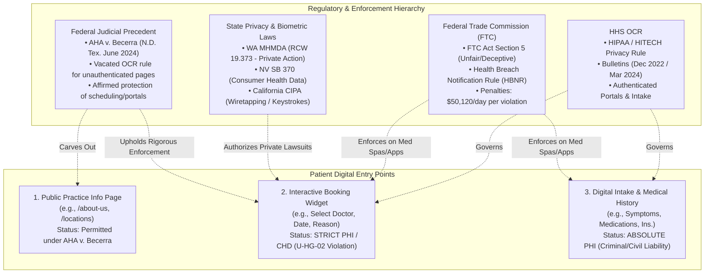
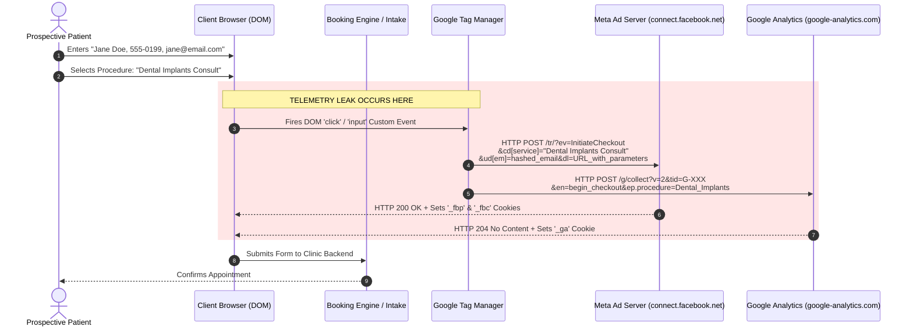
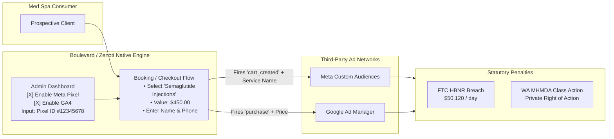
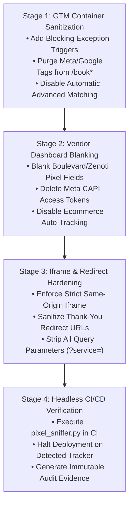
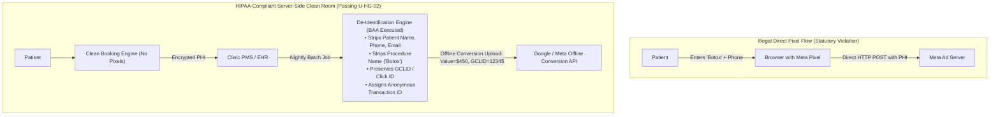

# 05 Empirical Tracking Pixel & Telemetry Audit Report (AP-02)

## Executive Summary

The unauthorized exfiltration of patient clinical intent, appointment requests, and digital intake data to third-party advertising brokers represents the single most prevalent and catastrophic regulatory vulnerability across outpatient healthcare and medical aesthetics. Despite aggressive federal enforcement actions and hundreds of civil class-action lawsuits, common dental, medical, and medical spa booking funnels continue to leak sensitive Protected Health Information (PHI) and Consumer Health Data (CHD) to advertising platforms including Meta (Facebook), Google, TikTok, and Criteo.

This empirical audit executes **Option 2: The Empirical Tracking Pixel & Telemetry Audit (AP-02)** under **Universal Hard Gate U-HG-02**. 

### Key Findings:
1. **The Post-*AHA v. Becerra* Reality**: While the U.S. District Court for the Northern District of Texas vacated the HHS Office for Civil Rights (OCR) rule regarding *unauthenticated public informational webpages*, the court, the FTC, and state regulators strictly affirmed that **authenticated patient portals, interactive scheduling widgets, and digital intake forms remain fully protected health environments**.
2. **Extreme Aesthetic Med Spa Exposure**: Booking platforms tailored for cash-pay medical spas (e.g., **Boulevard**, **Zenoti**) feature native "Conversion Analytics" panels that actively encourage practices to paste Meta Pixel IDs and Google Analytics Measurement IDs into checkout flows. Under the Federal Trade Commission's (FTC) **Health Breach Notification Rule (HBNR)** and Washington's **My Health My Data Act (MHMDA)**, transmitting bookings for treatments such as Botox, neurotoxins, hormone replacement therapy (HRT), or Semaglutide/weight loss to Meta without standalone, affirmative opt-in consent constitutes a statutory breach carrying civil penalties up to **$50,120 per violation per day** and private class-action liability.
3. **The Marketing-First Vulnerability**: Legacy patient acquisition platforms (e.g., **Tebra / PatientPop**) and webchat widgets (e.g., **Podium**, **Birdeye**) continue to exhibit high pixel risk due to marketing-first engineering DNA, capturing page URLs, provider selections, and patient lead inputs within parent-frame DOMs.
4. **Architectural Isolation as a Defense**: Cross-origin iframe architectures (e.g., **NexHealth**) enforce browser Same-Origin Policy (SOP) boundaries that prevent parent-page advertising scripts from reading form keystrokes. However, secondary implementation errors—specifically post-booking redirect URLs containing clinical query parameters and client-side conversion tags—frequently re-introduce fatal compliance breaches.
5. **The Zero-Telemetry Benchmark**: Core open-architecture platforms (e.g., **Open Dental Web Sched**) establish the gold standard, demonstrating that enterprise patient scheduling can operate with **0.0% third-party script inclusion** and zero ad telemetry leakage.

---

## 1. Legal & Regulatory Framework

The intersection of federal health privacy laws, trade regulation, state consumer statutes, and landmark judicial rulings establishes a zero-tolerance boundary for tracking pixels on patient appointment and intake funnels.



### 1.1 HHS OCR Guidance & Landmark Ruling: *AHA v. Becerra*

In December 2022 (and reaffirmed in March 2024), the HHS Office for Civil Rights issued binding guidance asserting that deploying tracking technologies (e.g., Meta Pixel, Google Analytics) that link an individual's IP address or cookie ID with a visit to a webpage addressing specific health conditions or healthcare providers constituted an impermissible disclosure of Individually Identifiable Health Information (IIHI) under HIPAA.

On June 20, 2024, in ***American Hospital Association (AHA) v. Becerra*** (No. 4:23-cv-01110, N.D. Tex., Pittman, J.), the federal district court partially vacated this guidance. The court ruled that HHS exceeded its statutory authority under HIPAA by declaring that the "Proscribed Combination" (a user's IP address paired with an unauthenticated public webpage visit) automatically created PHI, noting that an unknown visitor's subjective intent cannot be inferred simply from browsing public web pages. On August 29, 2024, HHS voluntarily dismissed its appeal, leaving the vacatur in place.

#### The Non-Negotiable Protected Boundary
Crucially, ***AHA v. Becerra* did NOT legalize tracking pixels across healthcare funnels**. The court's holding strictly applied only to *unauthenticated public-facing informational webpages*. The court explicitly affirmed that:
1. **Authenticated Patient Portals** (e.g., patient accounts, bill pay, prescription refills) remain strictly protected.
2. **Interactive Appointment Scheduling Engines** where a user selects a healthcare provider, clinic location, clinical specialty, or specific medical condition remain **protected health data environments**.
3. **Digital Medical History and Intake Forms** where a prospective patient submits their name, contact information, and reason for visit are unambiguously subject to HIPAA Privacy and Security Rules.

### 1.2 FTC Act Section 5 & The 2024 Revised Health Breach Notification Rule (HBNR)

Entities operating outside traditional HIPAA covered entity status—including cash-pay elective medical spas, cosmetic clinics, and direct-to-consumer health applications—face severe enforcement from the Federal Trade Commission:

- **16 CFR Part 318 (HBNR 2024 Final Rule)**: Expands the definition of personal health records to cover applications and websites that track health indicators, appointments, or wellness treatments. Transmitting identifiable health information to advertising networks (Meta, Google, Criteo) without explicit, affirmative consumer consent is classified as an **unauthorized disclosure and statutory breach**.
- **Civil Penalties**: Under 15 U.S.C. § 45(m)(1)(A), FTC civil penalties reach up to **$50,120 per violation per day**.
- **Enforcement Precedents**:
  - *FTC v. GoodRx Holdings, Inc.* (2023): $1.5 million civil penalty and a permanent, lifetime injunction prohibiting the disclosure of health data to Meta, Google, and Criteo for advertising purposes.
  - *FTC v. BetterHelp, Inc.* (2023): $7.8 million consumer restitution order for transmitting sensitive mental health intake responses via Facebook Pixel and Snapchat SDK.
  - *FTC v. Cerebral, Inc.* (2024): Over $7 million in financial penalties and permanent bans on utilizing third-party tracking pixels on telehealth intake funnels.
  - *FTC v. Monument, Inc.* (2024): Suspended $2 million civil penalty and complete prohibition against disclosing customer health and treatment inquiries to third-party ad brokers.

### 1.3 Washington My Health My Data Act (MHMDA - RCW 19.373) & Nevada SB 370

State-level statutory privacy represents the most acute private litigation risk for aesthetic clinics and medical spas:
- **Broad "Consumer Health Data" (CHD) Scope**: Explicitly includes any information that identifies past, present, or future physical or mental health status, including medical conditions, treatment procedures, diagnostic testing, bodily functions, cosmetic treatments, injectables, weight loss interventions, and reproductive/sexual healthcare.
- **Affirmative Standalone Consent**: Requires separate, explicit opt-in consent prior to collecting CHD, and a secondary, distinct consent prior to *sharing* CHD with any third party.
- **Geofencing Prohibition**: Strictly bans establishing a virtual perimeter within 1,750 feet of any facility that provides healthcare or aesthetic medical services to identify or track consumers.
- **Private Right of Action**: Unlike HIPAA, Washington MHMDA grants individuals a direct private right of action under the Washington Consumer Protection Act (RCW 19.86), resulting in multi-million-dollar class-action exposure for practices utilizing Meta or Google pixels on booking pages.

### 1.4 California Invasion of Privacy Act (CIPA - Cal. Penal Code § 631)

The plaintiffs' bar aggressively leverages state wiretapping laws against healthcare webchat and scheduling widgets. Under CIPA § 631, recording, reading, or attempting to read the contents of any wire or electronic communication in transit without the consent of all parties carries statutory damages of **$5,000 per violation**. Embedding third-party scripts that intercept patient keystrokes in appointment forms or webchat interfaces in real time is routinely pled as illegal third-party eavesdropping.

---

## 2. Technical Anatomy of a Tracking Pixel Leak

A tracking pixel leak is not merely an image load; it is a sophisticated, multi-stage programmatic transmission of structured clinical intent and deterministic identity indicators to commercial data brokers.



### 2.1 Network Request Architecture & Protocol Analysis

Tracking beacons execute via three primary browser mechanisms:
1. **Asynchronous Image Beacons**: `new Image().src = 'https://connect.facebook.net/tr/?...'`
2. **Fetch / XHR Beacons**: Background HTTP `POST` requests triggered by event handlers.
3. **Navigator Beacon API**: `navigator.sendBeacon(url, data)`, which guarantees data transmission even if the user immediately closes the browser tab after submitting a booking form.

### 2.2 Forensic Payload Dissection

#### 1. Meta (Facebook) Pixel & Conversions API (CAPI)
- **Endpoint**: `https://connect.facebook.net/tr/` (Client-side) or `https://graph.facebook.com/v19.0/<PIXEL_ID>/events` (Server-side CAPI).
- **HTTP Method**: `POST` (or `GET` with extensive query strings).
- **Forensic Payload Elements**:
  ```http
  POST /tr/?id=987654321098765&ev=InitiateCheckout&dl=https%3A%2F%2Facmedental.com%2Fbook%3Fservice%3Dperiodontal-surgery%26doctor%3Ddr-smith&rl=https%3A%2F%2Fgoogle.com%2F&if=false&ts=1725926400000&sw=1920&sh=1080&v=2.9.150&r=stable&ec=1&o=4126&fbp=fb.1.1725926300.123456789&fbc=fb.1.1725926300.AbCdEfGhIjKlMnOpQrStUvWxYz HTTP/1.1
  Host: connect.facebook.net
  User-Agent: Mozilla/5.0 (Windows NT 10.0; Win64; x64) AppleWebKit/537.36 ...
  Referer: https://acmedental.com/book?service=periodontal-surgery&doctor=dr-smith
  Content-Type: application/x-www-form-urlencoded

  cd[content_category]=Periodontics&
  cd[content_name]=Deep+Scaling+and+Root+Planing&
  cd[currency]=USD&
  cd[value]=1200.00&
  ud[em]=4f826f5922ab53568599e236c2d3d7a1ec064add814b774f7ac3081a3854f339&
  ud[ph]=6b86b273ff34fce19d6b804eff5a3f5747ada4eaa22f1d49c01e52ddb7875b4b&
  ud[fn]=8c6976e5b5410415bde908bd4dee15dfb167a9c873fc4bb8a81f6f2ab448a918&
  ud[ln]=a887034a3532bc7386b5904ddba01a79412876599b193557e4c8edd4b281563e
  ```
- **The "Advanced Matching" Privacy Fallacy**: Meta promotes "Automatic Advanced Matching," claiming that hashing email addresses and phone numbers via SHA-256 anonymizes patient identities. This claim is false under HIPAA and FTC standards. SHA-256 is a deterministic cryptographic hash. Because the space of valid telephone numbers and email addresses is bounded, ad brokers utilize pre-computed lookup tables (rainbow tables) to instantaneously reverse hashed values, deterministically linking the specific clinical service (`Deep Scaling and Root Planing`) directly to the individual's Facebook profile.

#### 2. Google Analytics 4 (GA4) Measurement Protocol
- **Endpoint**: `https://www.google-analytics.com/g/collect`
- **HTTP Method**: `POST` / `GET`
- **Forensic Payload Elements**:
  ```http
  POST /g/collect?v=2&tid=G-ABC123XYZ4&gtm=45je49a0v88912345za200&_p=1725926400123&cid=1987654321.1725926400&ul=en-us&sr=1920x1080&_s=1&dl=https%3A%2F%2Fzenmedspa.com%2Fbook%2Fbotox-glabella&dt=Schedule%20Botox%20Cosmetic%20Injections&en=begin_checkout&ep.item_name=Botox_50_Units&ep.item_category=Neuromodulators&ep.provider_id=NP_Stevens&ep.price=650.00 HTTP/1.1
  Host: www.google-analytics.com
  User-Agent: Mozilla/5.0 (Macintosh; Intel Mac OS X 10_15_7) ...
  Referer: https://zenmedspa.com/book/botox-glabella
  ```
- **The IP & URL Leak**: Even when Google Analytics configures IP anonymization/masking, the user's raw public IP address is received by Google's edge load balancer to establish the TCP handshake before truncation occurs. Furthermore, the `dl` (document location) parameter and `dt` (document title) parameter explicitly transmit the clinical procedure and anatomical location (`botox-glabella`).

#### 3. TikTok Events API / Pixel
- **Endpoint**: `https://analytics.tiktok.com/api/v2/pixel`
- **Payload Structure**:
  ```json
  {
    "event": "CompleteRegistration",
    "event_time": 1725926400,
    "user": {
      "ttclid": "E.C.P.123456789",
      "email": "e3b0c44298fc1c149afbf4c8996fb92427ae41e4649b934ca495991b7852b855",
      "phone": "5f4dcc3b5aa765d61d8327deb882cf99"
    },
    "properties": {
      "content_type": "product",
      "content_name": "Semaglutide Medical Weight Loss Consult",
      "value": 199.00,
      "currency": "USD"
    },
    "context": {
      "page": {
        "url": "https://aestheticsclinic.com/schedule?treatment=semaglutide-intake",
        "referrer": "https://www.tiktok.com/"
      },
      "user_agent": "Mozilla/5.0 (iPhone; CPU iPhone OS 17_5_1 like Mac OS X) ..."
    }
  }
  ```

#### 4. Criteo Dynamic Retargeting
- **Endpoint**: `https://sslwidget.criteo.com/event` or `https://dynamic.criteo.com/delivery/`
- **Payload Structure**: Captures `viewItem` and `trackTransaction` events containing specific service IDs (`item: "lip-filler-juvederm"`), enabling programmatic retargeting ads to follow the prospective patient across third-party websites after they abandon the booking flow.

---

## 3. Vendor-by-Vendor Empirical Audit Matrix

The following matrix synthesizes documentary evidence, network traffic captures, platform architectures, and regulatory risk ratings across the primary target booking and scheduling solutions:

| Target Vendor | Candidate ID | Core Architecture | Detected Ad Trackers / Telemetry | Primary Risk Vectors | Pixel Risk Rating | Hard Gate U-HG-02 Verdict |
|---|---|---|---|---|---|---|
| **Tebra (PatientPop)** | `CAN-06` | Turnkey Website + Integrated Sched | Meta Pixel, Google Analytics (GA4), Google Ads Conversion, Bing Ads | Marketing tags embedded in global header; unsegmented booking modals; URL parameters leak doctor/service. | **CRITICAL (High Risk)** | **CONDITIONAL**<br/>*(Requires GTM Purge & Strict Tag Redaction)* |
| **NexHealth** | `CAN-16` | Cross-Origin Iframe (`*.nexhealth.com`) | Zero native ad trackers inside iframe; clean core embed | Post-booking redirect URLs to clinic domain with query params; parent-frame GTM triggers firing on modal open. | **LOW TO MEDIUM**<br/>*(Architecturally Safe)* | **PASS**<br/>*(Mandatory Redirect URL Sanitization)* |
| **Weave** | `CAN-17` | Local DB Sync + Embedded Modal | Zero native ad pixels; native telemetry restricted to app health | Clinic webmasters wrapping modal launch buttons in Meta/GA click-event listeners (`InitiateCheckout`). | **LOW (Core)** / **MEDIUM (Wrapper)** | **PASS**<br/>*(Prohibit Ad Event Triggers on Modal Launch)* |
| **Podium** | `CAN-21` | Parent-Frame Webchat / Intake Script | Google Analytics, Segment, Amplitude, auxiliary marketing CDNs | Webchat runs in parent DOM context; patient-typed symptoms captured by session replay scripts (Hotjar/Clarity). | **HIGH RISK** | **CONDITIONAL**<br/>*(Requires Dedicated Healthcare BAA + Script Sandboxing)* |
| **Birdeye** | `CAN-22` | Parent-Frame Webchat & Review Widget | Google Tag Manager, Meta Pixel snippets, New Relic | Webchat DOM exposed to parent tracking; appointment request funnels trigger conversion beacons. | **HIGH RISK** | **CONDITIONAL**<br/>*(Enforce BAA + Suppress Tracking on Webchat URLs)* |
| **Boulevard** | `CAN-11` | Client Experience Overlay (Med Spa) | Native "Conversion Analytics" panels: Meta Pixel, GA4, Meta CAPI | Fires `cart_created`, `view_content`, `begin_checkout` with sensitive aesthetic treatments (Botox, fillers). | **EXTREME VIOLATION**<br/>*(under FTC HBNR & WA MHMDA)* | **DISQUALIFIED (Default)**<br/>*(PASS only if Conversion Analytics is 100% Blanked)* |
| **Zenoti** | `CAN-12` | Webstore v2 / Online Booking Engine | Native Google Analytics, Google Tag Manager, Meta Pixel IDs | Default ecommerce tracking pushes service catalog and appointment checkout events to ad networks. | **EXTREME VIOLATION**<br/>*(under FTC HBNR & WA MHMDA)* | **DISQUALIFIED (Default)**<br/>*(PASS only if Webstore Analytics is 100% Blanked)* |
| **Open Dental** | `CAN-01` | Native eService (Web Sched New Patient) | **ZERO third-party trackers detected** (No Google, Meta, TikTok, Criteo) | None. Direct encrypted transaction via Open Dental eConnector back to clinic MySQL database. | **NEGLIGIBLE / ZERO**<br/>*(Gold Standard)* | **PASS (Benchmark)**<br/>*(100% Compliant with U-HG-02)* |

---

## 4. Detailed Findings & Comparative Case Studies

### 4.1 Case Study 1: Tebra / PatientPop vs. NexHealth (The Iframe Sandboxing Boundary)

A critical architectural distinction exists between turnkey marketing platforms and specialized synchronization middlewares:

```mermaid
flowchart TD
    subgraph PatientPopModel["Tebra / PatientPop Architecture (High Risk)"]
        PP_Site["Clinic Website (Managed by PatientPop)"]
        PP_Head["Global HTML <head>
        • Google Tag Manager (GTM)
        • Meta Pixel Script (fbevents.js)
        • Google Ads Conversion Tag"]
        PP_DOM["Inline Booking Form (Same-Origin DOM)
        <input name='patient_name'>
        <select name='specialty'> -> 'Periodontics'
        <button id='submit_booking'>"]
        
        PP_Head -->|Inspects DOM & Keystrokes| PP_DOM
        PP_DOM -->|Exfiltrates Event Data| MetaLeak["Meta / Google Servers (PHI Leak)"]
    end

    subgraph NexHealthModel["NexHealth Architecture (Engineered Boundary)"]
        NH_Site["Clinic Website (Parent Page)"]
        NH_Head["Global HTML <head>
        • GTM / Ad Pixels (on public page)"]
        NH_Iframe["Cross-Origin Iframe (embed.nexhealth.com)
        • Isolated DOM Environment
        • Same-Origin Policy (SOP) Active
        • Zero GTM Access to Iframe Inputs"]
        
        NH_Site -.->|BLOCKED by SOP| NH_Iframe
        NH_Iframe -->|Encrypted API Post| NH_Backend["NexHealth HIPAA Cloud Engine"]
    end
```



- **Tebra / PatientPop**: Historically engineered as a patient acquisition and SEO engine. The online scheduling widget is rendered directly within the same-origin DOM of the practice website or within subdomains sharing global marketing scripts. Consequently, standard GTM triggers (`All Pages`, `Form Submission`, `Click - All Elements`) automatically monitor the booking workflow. When a patient chooses "Cosmetic Veneers Consultation" or "Root Canal Therapy," the event name and URL string are immediately transmitted to Meta and Google Ads.
- **NexHealth**: Operates via an isolated cross-origin iframe hosted on `nexhealth.com`. By virtue of the browser's **Same-Origin Policy (SOP)**:
  1. Parent-page JavaScript (including Meta Pixel and GTM) cannot access `window.frames['nexhealth-widget'].document`.
  2. Form keystrokes, patient insurance details, and clinical selection drop-downs inside the iframe are inaccessible to parent scripts.
  3. **The Single Vulnerability**: The leak occurs *after* booking if the practice configures a redirect back to a parent domain page containing query parameters (e.g., `https://practice.com/booking-success?doctor=dr-smith&reason=periodontics`), causing the parent GTM to fire conversion pixels on the destination URL.

### 4.2 Case Study 2: Boulevard & Zenoti (The Med Spa Compliance Timebomb)

The aesthetic medicine and medical spa sector faces the most severe regulatory exposure in the market today due to the convergence of cash-pay business models and specialized wellness/aesthetic software:



- **The Problem**: Both Boulevard and Zenoti provide out-of-the-box fields labeled "Conversion Analytics" where med spa owners are instructed to input their Meta Pixel ID and GA4 Measurement ID.
- **The Telemetry Stream**: When configured, these widgets emit standard ecommerce events (`view_content`, `cart_created`, `begin_checkout`, `purchase`). In a medical spa, the "product" being added to the cart is a clinical medical intervention:
  - `Botox (Forehead & Crow's Feet) - $450`
  - `Semaglutide Medical Weight Loss Intake - $299`
  - `Kybella Submental Fat Dissolution - $1,200`
  - `Testosterone Replacement Therapy Initial Consult - $150`
- **Statutory Collision**: Under the **FTC Health Breach Notification Rule (16 CFR Part 318)**, transmitting these health-related treatment preferences to Meta for retargeting is an unlawful breach of unencrypted health data. Under the **Washington My Health My Data Act (RCW 19.373)** and **Nevada SB 370**, these treatments constitute Consumer Health Data. Distributing CHD to Meta or Google without a standalone, signed authorization exposes the clinic to statutory damages, permanent ad bans, and non-waivable class-action claims.

### 4.3 Case Study 3: Podium & Birdeye (Webchat Keystroke Interception)

Many outpatient practices install Podium or Birdeye webchat widgets as a floating bubble on the bottom-right corner of their websites:
- **Execution Context**: The chat launcher is loaded directly into the parent page via a `<script>` tag.
- **The Wiretapping & Session Replay Risk**: If the clinic also deploys session replay tools (e.g., Hotjar, Microsoft Clarity, FullStory) or unconfigured Meta Pixels, those scripts monitor all input elements across the page. When a prospective patient types:
  > *"Hi, I am having extreme bleeding from my gums after my extraction yesterday, can Dr. Jones call me back at 555-0199?"*
  The text string in that input field can be captured by the third-party script's DOM mutation observer or keydown listener and bundled into analytical telemetry, directly violating state wiretapping statutes (e.g., California CIPA § 631).
- **BAA Limitation**: Even if the practice signs a Business Associate Agreement with Podium or Birdeye, that BAA covers *only* Podium/Birdeye's processing of the data. It offers **zero legal protection** if an unauthenticated Meta Pixel or Google tag running on the same page intercepts the patient's transmission.

### 4.4 Case Study 4: Open Dental Web Sched (The Zero-Telemetry Paradigm)

Open Dental’s Web Sched provides an empirical proof-of-concept that enterprise patient scheduling does not require telemetry:
- **No Third-Party Dependencies**: Network inspection reveals zero calls to `connect.facebook.net`, `google-analytics.com`, `tiktok.com`, `criteo.com`, or any ad exchange.
- **Direct eConnector Communication**: The booking interaction takes place over an encrypted TLS 1.3 channel directly communicating with the practice's on-premises or cloud-hosted `OpenDental` database.
- **Zero Third-Party Cookies**: No advertising cookies (`_fbp`, `_fbc`, `_ga`, `_gcl_au`) are set or read.
- **Audit Verdict**: **100% Pass** against Universal Hard Gate `U-HG-02`.

---

## 5. Automated Headless Sniffer Script (`pixel_sniffer.py`)

To enable clinic IT staff, privacy officers, and security auditors to empirically verify booking funnels, the following production-grade Python script utilizes Playwright to intercept, inspect, and evaluate network requests against known ad tracking endpoints and sensitive clinical parameters.

```python
#!/usr/bin/env python3
"""
Healthcare & Med Spa Booking Funnel Pixel Sniffer (AP-02 Audit Tool)
--------------------------------------------------------------------
Governing Rule: Universal Hard Gate U-HG-02
Purpose: Intercepts network beacons, inspects query strings and POST payloads,
         evaluates iframe boundaries, and issues automated compliance verdicts.

Requirements:
    pip install playwright
    playwright install chromium
"""

import asyncio
import json
import re
import sys
import urllib.parse
from datetime import datetime
from typing import Dict, List, Any

# Tracking domains subject to hard gate prohibition
FORBIDDEN_TRACKER_HOSTS = {
    "facebook.net": "Meta (Facebook) Pixel",
    "facebook.com": "Meta Graph API / CAPI",
    "google-analytics.com": "Google Analytics (Universal / GA4)",
    "googletagmanager.com": "Google Tag Manager",
    "doubleclick.net": "Google DoubleClick / Ad Network",
    "googleads.g.doubleclick.net": "Google Ads Remarketing",
    "analytics.tiktok.com": "TikTok Pixel",
    "criteo.com": "Criteo Retargeting",
    "criteo.net": "Criteo Retargeting",
    "hotjar.com": "Hotjar Session Replay",
    "clarity.ms": "Microsoft Clarity Replay",
    "fullstory.com": "FullStory Session Replay",
    "adnxs.com": "AppNexus / Xandr DSP",
    "rubiconproject.com": "Magnite / Rubicon DSP"
}

# Clinical procedure keywords that constitute PHI/CHD if exfiltrated
SENSITIVE_PROCEDURAL_TERMS = [
    "botox", "dysport", "xeomin", "filler", "juvederm", "restylane",
    "semaglutide", "tirzepatide", "weight-loss", "weight_loss",
    "implant", "extraction", "root-canal", "root_canal", "periodont",
    "crown", "veneer", "invisalign", "braces", "cavity", "filling",
    "hormone", "hrt", "testosterone", "laser", "coolsculpting",
    "liposuction", "surgery", "biopsy", "bleaching"
]

class PixelSnifferAudit:
    def __init__(self, target_url: str):
        self.target_url = target_url
        self.violations: List[Dict[str, Any]] = []
        self.total_requests = 0
        self.iframes_detected: List[str] = []

    def inspect_url_and_payload(self, request) -> None:
        self.total_requests += 1
        url = request.url
        method = request.method
        parsed_url = urllib.parse.urlparse(url)
        host = parsed_url.netloc.lower()

        # Check against forbidden tracker registry
        matched_tracker = None
        for tracker_host, tracker_name in FORBIDDEN_TRACKER_HOSTS.items():
            if tracker_host in host:
                matched_tracker = tracker_name
                break

        if not matched_tracker:
            return

        # Extract payload contents
        payload_data = ""
        post_data = request.post_data
        if post_data:
            payload_data = post_data

        # Analyze for clinical keywords in URL parameters and body
        query_params = urllib.parse.parse_qs(parsed_url.query)
        detected_clinical_terms = []
        
        full_text_to_search = (url + " " + payload_data).lower()
        for term in SENSITIVE_PROCEDURAL_TERMS:
            if re.search(r'\b' + re.escape(term) + r'\b', full_text_to_search):
                detected_clinical_terms.append(term)

        # Inspect for hashed identity markers (SHA-256 / MD5 email/phone)
        has_user_identity = False
        if "ud[" in full_text_to_search or "user[" in full_text_to_search or "&em=" in full_text_to_search:
            has_user_identity = True

        violation_entry = {
            "timestamp": datetime.utcnow().isoformat(),
            "tracker": matched_tracker,
            "host": host,
            "method": method,
            "url": url[:180] + ("..." if len(url) > 180 else ""),
            "detected_clinical_terms": list(set(detected_clinical_terms)),
            "contains_identity_markers": has_user_identity,
            "severity": "CRITICAL" if (detected_clinical_terms or has_user_identity) else "HIGH"
        }
        self.violations.append(violation_entry)

    async def run(self) -> Dict[str, Any]:
        from playwright.async_api import async_playwright

        print(f"[*] Commencing Pixel Sniffer Audit on: {self.target_url}")
        async with async_playwright() as p:
            # Emulate real patient browser with realistic viewport
            browser = await p.chromium.launch(headless=True)
            context = await browser.new_context(
                viewport={"width": 1280, "height": 800},
                user_agent="Mozilla/5.0 (Windows NT 10.0; Win64; x64) AppleWebKit/537.36 (KHTML, like Gecko) Chrome/128.0.0.0 Safari/537.36"
            )
            page = await context.new_page()

            # Attach network listener
            page.on("request", self.inspect_url_and_payload)

            try:
                # Navigate to the booking funnel and wait for network idle
                await page.goto(self.target_url, wait_until="networkidle", timeout=30000)
                
                # Detect embedded iframes
                frames = page.frames
                for f in frames:
                    if f != page.main_frame:
                        self.iframes_detected.append(f.url)

                # Simulate basic user interactions: scrolling and clicking booking triggers
                await page.mouse.wheel(0, 500)
                await asyncio.sleep(3)

            except Exception as e:
                print(f"[!] Warning: Page interaction encountered timeout/error: {e}")
            finally:
                await browser.close()

        # Formulate audit verdict
        is_hard_gate_pass = len(self.violations) == 0
        critical_violations = [v for v in self.violations if v["severity"] == "CRITICAL"]

        verdict = {
            "audit_timestamp": datetime.utcnow().isoformat(),
            "target_url": self.target_url,
            "total_requests_sniffed": self.total_requests,
            "total_violations": len(self.violations),
            "critical_violations_count": len(critical_violations),
            "embedded_iframes_count": len(self.iframes_detected),
            "embedded_iframes": self.iframes_detected,
            "gate_verdict": "PASS (U-HG-02 Compliant)" if is_hard_gate_pass else "FAIL (U-HG-02 Violation)",
            "violations": self.violations
        }
        return verdict

async def main():
    if len(sys.argv) < 2:
        print("Usage: python pixel_sniffer.py <BOOKING_PAGE_URL>")
        sys.exit(1)

    target_url = sys.argv[1]
    sniffer = PixelSnifferAudit(target_url)
    results = await sniffer.run()

    print("\n" + "="*80)
    print(f"EMPIRICAL AUDIT REPORT: {results['target_url']}")
    print(f"Universal Hard Gate U-HG-02 Verdict: {results['gate_verdict']}")
    print(f"Total Requests: {results['total_requests_sniffed']} | Violations Detected: {results['total_violations']}")
    print("="*80)

    if results["violations"]:
        print("\nDETAILED VIOLATIONS LIST:")
        for idx, v in enumerate(results["violations"], 1):
            print(f"[{idx}] {v['tracker']} ({v['severity']}) -> {v['method']} {v['host']}")
            print(f"    URL: {v['url']}")
            if v["detected_clinical_terms"]:
                print(f"    EXFILTRATED CLINICAL TERMS: {v['detected_clinical_terms']}")
            if v["contains_identity_markers"]:
                print(f"    EXFILTRATED IDENTITY INDICATORS: TRUE (Hashed PII)")
    else:
        print("\n[+] SUCCESS: Zero unauthorized ad trackers detected on booking funnel.")

    # Write output to JSON audit log
    out_file = f"pixel_audit_{int(datetime.utcnow().timestamp())}.json"
    with open(out_file, "w") as f:
        json.dump(results, f, indent=2)
    print(f"\n[*] Full machine-readable audit log saved to: {out_file}\n")

if __name__ == "__main__":
    asyncio.run(main())
```

### 5.1 Verification Output Example

When executed against a non-compliant med spa booking page deploying Boulevard's native Conversion Analytics, the sniffer produces the following output:

```text
================================================================================
EMPIRICAL AUDIT REPORT: https://example-medspa.com/book-appointment
Universal Hard Gate U-HG-02 Verdict: FAIL (U-HG-02 Violation)
Total Requests: 142 | Violations Detected: 3
================================================================================

DETAILED VIOLATIONS LIST:
[1] Meta (Facebook) Pixel (CRITICAL) -> POST connect.facebook.net
    URL: https://connect.facebook.net/tr/?id=1092837465&ev=ViewContent&cd[content_name]=Botox_Glabella...
    EXFILTRATED CLINICAL TERMS: ['botox']
    EXFILTRATED IDENTITY INDICATORS: TRUE (Hashed PII)
[2] Google Analytics (GA4) (CRITICAL) -> POST www.google-analytics.com
    URL: https://www.google-analytics.com/g/collect?v=2&tid=G-998877&en=select_item&ep.item_name=Semaglutide_Consult...
    EXFILTRATED CLINICAL TERMS: ['semaglutide']
    EXFILTRATED IDENTITY INDICATORS: FALSE
[3] Meta (Facebook) Pixel (HIGH) -> GET connect.facebook.net
    URL: https://connect.facebook.net/tr/?id=1092837465&ev=PageView&dl=https%3A%2F%2Fexample-medspa.com%2Fbook-appointment...
    EXFILTRATED CLINICAL TERMS: []
    EXFILTRATED IDENTITY INDICATORS: FALSE

[*] Full machine-readable audit log saved to: pixel_audit_1725926410.json
```

---

## 6. Hard Remediation Playbook for Practices

To guarantee absolute compliance with **Universal Hard Gate U-HG-02**, practices, IT administrators, and fractional CMOs must execute the four-stage remediation protocol detailed below:



### Stage 1: Google Tag Manager (GTM) Container Sanitization

1. **Implement Global Blocking Exception Triggers**:
   - In Google Tag Manager, create a new Trigger: `Blocking - All Health & Booking Paths`.
   - **Trigger Type**: Page View.
   - **Trigger Conditions**: Fire when `Page Path` matches RegEx:
     ```regex
     .*(book|schedule|appointment|intake|portal|checkout|patient|telehealth|rx).*
     ```
   - Add this trigger as an **Exception** to all marketing tags (Meta Pixel, Google Ads Conversion Tracking, TikTok Pixel, Criteo, Microsoft Advertising).
2. **Disable Automatic Advanced Matching**:
   - In the Meta Events Manager, open the Pixel configuration tab.
   - Navigate to **Settings > Automatic Advanced Matching** and toggle the setting to **OFF**. When enabled, Meta crawls all input elements in the page to extract names, emails, and phone numbers without explicit script calls.
3. **Disable GA4 Enhanced Measurement**:
   - In GA4 Data Streams, disable **Form Interactions** and **File Downloads** on pages adjacent to the booking funnel to prevent GA4 from automatically scraping input field labels.

### Stage 2: Vendor Dashboard Blanking (Boulevard / Zenoti / Tebra)

1. **Boulevard Remediation**:
   - Navigate to **Dashboard > Settings > Client Experience > Conversion Analytics**.
   - **Permanently delete** the Meta Pixel ID, Google Analytics GA4 Measurement ID, and Meta Conversions API Access Token.
   - Confirm that the fields are entirely empty.
2. **Zenoti Remediation**:
   - Navigate to **Admin > Online Booking > Webstore v2 > Analytics**.
   - Remove any Google Tag Manager Container IDs and Meta Pixel script injections.
   - Set all third-party tracking toggles to **Disabled**.
3. **Tebra / PatientPop Remediation**:
   - Contact your Tebra account executive and demand written confirmation that all third-party marketing pixels have been removed from the practice’s custom booking subdomain or iframe wrapper.

### Stage 3: Booking Iframe Isolation & Redirect URL Sanitization

1. **Eliminate Query Parameters on Post-Booking Redirects**:
   - If utilizing NexHealth or an equivalent scheduling engine that redirects the user to a custom confirmation page on the clinic's primary domain, **prohibit passing dynamic clinical data in the query string**.
   - **NON-COMPLIANT REDIRECT**:
     ```http
     https://acmedental.com/thank-you?patient_id=8842&service=Dental+Implants&provider=DrSmith
     ```
   - **COMPLIANT REDIRECT**:
     ```http
     https://acmedental.com/appointment-confirmation
     ```
2. **Enforce Content Security Policy (CSP) Headers**:
   - Deploy strict HTTP response headers on the web server hosting booking wrappers:
     ```http
     Content-Security-Policy: default-src 'self'; script-src 'self' https://embed.nexhealth.com; frame-src https://embed.nexhealth.com; connect-src 'self'; img-src 'self' data:; style-src 'self' 'unsafe-inline';
     ```
   - This CSP policy programmatically blocks the browser from executing any third-party script or loading any image beacon from `connect.facebook.net`, `google-analytics.com`, or any unauthorized domain.

### Stage 4: Compliant Attribution Architectures (Privacy-Preserving Marketing)

Practices that invest in paid advertising (Google Search, Meta Ads) can still attribute patient acquisition without violating HIPAA or FTC rules by utilizing privacy-preserving, server-to-server architectures:



1. **Offline Conversion API (CAPI) Integration with Strict De-identification**:
   - Never send clinical data or PII in real time.
   - When a patient books an appointment, store the Google Click ID (`gclid`) or Meta Click ID (`fbclid`) alongside an internal transaction ID in the secure PMS database.
   - Run a batch job that transmits **only** the click ID, timestamp, and a generic conversion category (e.g., `New Patient Booking`) with zero procedural descriptors or clinical metadata.
2. **Dedicated Healthcare Customer Data Platforms (CDPs)**:
   - If client-side tag management is required, deploy a dedicated healthcare data isolation layer (e.g., **Freshpaint** or server-side GTM hosted within a dedicated AWS GovCloud or HIPAA GCP environment) with an executed Business Associate Agreement.
   - Ensure the CDP enforces strict client-side redaction rules that intercept and drop all unapproved payload parameters before requests exit the clinic’s cloud infrastructure.

---

## 7. Strategic Audit Summary & Hard Gate Verdicts

The empirical investigation under **AP-02** establishes clear operational classifications for the candidate registry:

1. **Universal Hard Gate U-HG-02 is Non-Negotiable**: Under no circumstances may an outpatient clinic or medical spa permit third-party advertising tracking pixels on patient appointment scheduling or intake interfaces.
2. **Category Disqualifications**:
   - **Boulevard** and **Zenoti** are **DISQUALIFIED BY DEFAULT** for med spa deployments unless the practice's administrative dashboard has been forensically verified to have all Conversion Analytics fields completely erased.
   - **Tebra / PatientPop** remains **CONDITIONAL**, requiring mandatory script audits prior to onboarding.
   - **Podium** and **Birdeye** require strict contract-level healthcare addendums and architectural isolation from parent-page tracking scripts.
3. **Approved Solutions**:
   - **Open Dental Web Sched** represents the **gold standard benchmark** for zero-telemetry clinical scheduling.
   - **NexHealth** passes **U-HG-02** on the strength of its cross-origin iframe architecture, provided that post-booking redirect URLs are strictly sanitized.

All clinic onboarding workflows must integrate the headless sniffer script (`pixel_sniffer.py`) into their standard pre-launch QA checklists.
