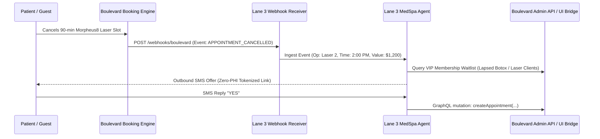
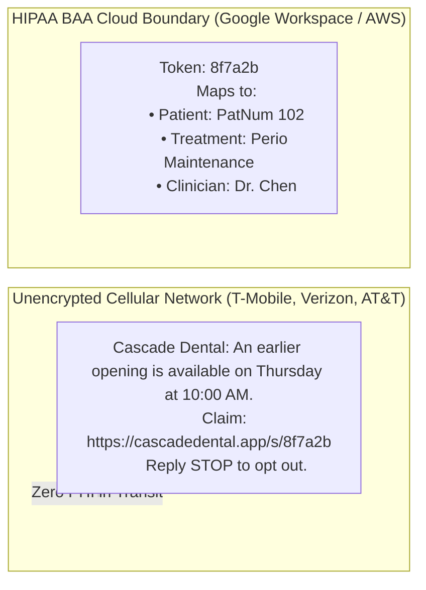

# 06 PMS & Carrier Integration Architecture

## Executive Summary

Autonomous AI agents in outpatient healthcare (dentistry, aesthetics, and dermatology) cannot create clinical or operational value in a vacuum. To recover cancelled appointments, re-engage overdue patients, and handle inbound inquiries, agents must interface with two deeply protected and divergent infrastructure layers:
1. **The Practice Management System (PMS)**: Often locked inside legacy client-server relational databases running on an on-premise Windows server behind symmetric clinic firewalls (e.g. Open Dental on MariaDB/MySQL, Dentrix on FairCom c-tree, Eaglesoft on SAP SQL Anywhere), or gated behind enterprise SaaS pricing tiers (Boulevard GraphQL, Zenoti REST v2).
2. **The Cellular Telecommunications Network**: Regulated by the FCC, CTIA, and The Campaign Registry (TCR) under strict A2P 10DLC (Application-to-Person 10-Digit Long Code) registration rules, TCPA carrier opt-out mandates, and HHS/OCR HIPAA rules governing Protected Health Information (PHI) over unencrypted cellular protocols.

This engineering specification reverse-engineers the exact connection mechanics, database access methods, API protocols, carrier registration workflows, and network security topologies necessary to deploy **Lane 3 Open-Source Agent Middleware**. It introduces the **Zero-Port Clinic Edge Connector Blueprint** and the **Zero-PHI SMS Token Standard**, allowing practices to eliminate $2,000+/month in third-party aggregator tolls (NexHealth, Weave, PatientPop) with 100% HIPAA and TCPA compliance.

---

## 1. Master Comparative PMS Integration Matrix

| Platform | Architectural Type | Primary DB Engine | Official API Availability & Tier | Monthly API Cost / Location | Writeback Capability | Webhook Support | Recommended Lane 3 Connection Method |
|:---|:---|:---|:---|:---|:---|:---|:---|
| **Open Dental** | Client-Server / Hybrid Cloud | MySQL / MariaDB (InnoDB) | Open REST API v1 via eConnector; direct SQL permitted | **$0** (Read-Only) to **$35/mo** (Full Write); **$0/mo** via direct MySQL | Full (Atomic bidirectional ACID locks) | Native Webhooks via eConnector or local DB poll | **Direct Local MySQL Engine** (Sub-10ms) + eConnector fallback |
| **Dentrix (G4–G7)** | On-Premise Legacy | FairCom c-treeACE / SQL | Henry Schein One Developer Program (eCentral/DDX) | **$500/mo** + revenue share & certification fees | Gated writeback via proprietary HSOne DLLs | None (Requires 1–5s polling) | **Local Edge Service (ODBC / Transaction Log Sniffer)** |
| **Eaglesoft (v18–v22)** | On-Premise Legacy | SAP Sybase SQL Anywhere | Patterson Developer Program / Direct ODBC | **$450–$600/mo** vendor fee | High-risk direct write (unsupported by vendor) | None (Requires polling) | **Local Edge Service (Sybase ODBC / Read-Replica)** |
| **Curve Dental** | Multi-Tenant Cloud Native | AWS Cloud Relational | Proprietary REST API (Partner-Gated) | Custom quote ($250–$400/mo) | Full (via REST endpoints) | Limited Event Webhooks | **Cloud-to-Cloud REST Bridge (OAuth 2.0)** |
| **Boulevard (Med Spa)** | Modern Cloud SaaS | Cloud PostgreSQL / AWS | Client GraphQL + Admin GraphQL API | **Enterprise Tier Only** ($600+/mo base software tier) | Full (Cart, Bookings, Clients) | Webhooks (`APPOINTMENT_CREATED`, etc.) | **Admin GraphQL + Webhook Ingestion Engine** |
| **Zenoti (Med Spa / Spa)**| Enterprise Cloud SaaS | Cloud Multi-Tenant | REST API v2 (`docs.zenoti.com`) | Tier-dependent (API key per center) | Full (Bookings, Guests, Invoices) | Native Webhooks (60 req/min rate limit) | **REST API v2 + Webhook Automation Receiver** |

---

## 2. Deep-Dive: Dental On-Premise Reverse Engineering

### 2.1 Open Dental: The Gold Standard for Open Agent Architecture
Unlike its competitors, Open Dental does not obfuscate or encrypt its relational database. 

#### Connection Topologies:
1. **Topology A: Direct Local Database Connection (Zero Monthly Fee)**
   - **Protocol**: MySQL Native Protocol (Port 3306) over local loopback or private subnet.
   - **Credentials**: Standard MariaDB user credentials provisioned with `SELECT, INSERT, UPDATE` on the `opendental` schema.
   - **Performance**: 2 to 8 milliseconds per query. Zero cloud dependency, zero API rate limits, zero third-party subscription costs.
   - **ACID Safety Rule**: When writing back appointments, always wrap `appointment` and `histappointment` writes within an explicit database transaction (`BEGIN TRANSACTION ... COMMIT;`) to prevent partial slot allocations.

2. **Topology B: Official Open Dental REST API (eConnector)**
   - **Protocol**: RESTful JSON over HTTPS (`https://api.opendental.com/api/v1/...`).
   - **Prerequisites**:
     - Customer enables API in Open Dental: `Setup > Advanced Setup > API > Enabled`.
     - Developer obtains Developer API Key from `vendor.relations@opendental.com`.
     - Customer generates Customer API Key within their Open Dental portal.
   - **Pricing**:
     - *Free*: Read-all queries (throttled to 1 request per 5 seconds).
     - *$15/month*: Standard comms and basic setup (1 req/sec).
     - *$35/month*: Full unrestricted read/write access.
   - **Use Case**: Ideal when the clinic IT policy strictly prohibits running local database services and prefers vendor-managed HTTP boundaries.

#### Critical SQL Queries for Lane 3 Agents:

```sql
-- 1. Identify Broken Appointments and Sudden Holes (< 48 Hours Ahead)
SELECT 
    apt.AptNum,
    apt.PatNum,
    apt.AptDateTime,
    apt.Op,
    apt.ProvNum,
    apt.Pattern,
    apt.Note,
    p.FName,
    p.LName,
    p.WirelessPhone
FROM appointment apt
INNER JOIN patient p ON apt.PatNum = p.PatNum
WHERE apt.AptStatus = 5 -- 5 = Broken / Cancelled
  AND apt.AptDateTime BETWEEN NOW() AND DATE_ADD(NOW(), INTERVAL 48 HOUR)
ORDER BY apt.AptDateTime ASC;

-- 2. Retrieve Top Priority Overdue Recall Patients for Target Operatory
SELECT 
    p.PatNum,
    p.FName,
    p.LName,
    p.WirelessPhone,
    r.DateDue,
    DATEDIFF(NOW(), r.DateDue) AS DaysOverdue,
    rf.RecallTypeNum
FROM recall r
INNER JOIN patient p ON r.PatNum = p.PatNum
INNER JOIN recalltrigger rt ON r.RecallTypeNum = rt.RecallTypeNum
LEFT JOIN appointment a ON p.PatNum = a.PatNum AND a.AptStatus IN (1, 2) AND a.AptDateTime > NOW()
WHERE r.DateDue <= NOW()
  AND a.AptNum IS NULL -- Exclude patients who already have an upcoming appointment
  AND p.PatStatus = 0  -- 0 = Active Patient
  AND p.PreferContactMethod IN (0, 1) -- 1 = Wireless SMS preferred
  AND LENGTH(p.WirelessPhone) >= 10
ORDER BY DaysOverdue DESC
LIMIT 20;

-- 3. Atomic Slot Claim & Schedule Locking Transaction
START TRANSACTION;
SELECT AptStatus FROM appointment WHERE AptNum = 1042 FOR UPDATE;
-- If AptStatus is 5 (Broken) or empty:
UPDATE appointment 
SET PatNum = 8821,
    AptStatus = 1, -- 1 = Scheduled
    Confirmed = 19, -- 19 = Confirmed via SMS / Automation
    Note = CONCAT(IFNULL(Note, ''), ' [Lane3 Agent Claimed: Pat #8821 via SMS]')
WHERE AptNum = 1042 AND AptStatus = 5;
COMMIT;
```

---

### 2.2 Dentrix (G4 through G7): Bypassing the Proprietary Wall
Dentrix stores clinical and demographic data using the proprietary **FairCom c-treeACE** database engine. It does not provide an open SQL interface to third-party developers without joining the **Henry Schein One (HSOne) Developer Program**, which imposes:
- \$500/month recurring developer fee per registered application.
- Per-practice monthly license surcharges.
- Mandatory code audits and legal indemnification agreements.

#### Reverse-Engineering Dentrix Connectivity:
To build an open-source bridge without paying HSOne monopoly rents:
1. **Local ODBC Driver Access**:
   Dentrix installs a read-only 32-bit/64-bit ODBC driver (`Dentrix c-tree Plus ODBC Driver`) located at `C:\Program Files (x86)\Dentrix\Common\ctree.dll`. A local Python or C# service can connect via Windows ODBC connection strings:
   ```
   Driver={Dentrix ODBC Driver};Host=localhost;Database=DENTRIX;DataDir=C:\Dentrix\Data;UID=admin;PWD=...
   ```
2. **Transaction Log Sniffing**:
   Dentrix writes record modifications to sequential data log files (`DENTRIX.LOG` / `DENTRIX.DAT`). By monitoring Windows file alteration notifications via the Win32 `ReadDirectoryChangesW` API, an edge daemon can detect appointment cancellations within 500 milliseconds of front-desk entry.
3. **Writeback Mechanics**:
   Because direct writes to c-tree data files risk index corruption if the Dentrix G7 server is running, the safest writeback method without HSOne DLLs is **Local UI Automation / DDX Bridge Emulation** or utilizing the practice's existing Dentrix QuickBill / eCentral staging queue.

---

### 2.3 Eaglesoft (v18 through v22): SAP Sybase SQL Anywhere Integration
Eaglesoft (Patterson Dental) operates on an embedded **SAP Sybase SQL Anywhere** engine (historically Adaptive Server Anywhere).

#### Connection Mechanics:
1. **Direct ODBC / OLE-DB**:
   Eaglesoft includes the `Sybase SQL Anywhere 17 Driver`. A local edge daemon connects directly:
   ```
   Driver={SQL Anywhere 17};Server=EaglesoftServer;Database=Eaglesoft;UID=dba;PWD=sql;
   ```
2. **Schema Characteristics**:
   - Patient Table: `dbo.PATIENT`
   - Appointment Schedule: `dbo.APPOINTMENT` (`status_code` indicates Broken, Scheduled, or Checked-in).
   - Operatory Mapping: `dbo.CHAIR`
3. **Vendor Policy Risk**: Patterson Dental strictly disclaims warranty support if non-Patterson software writes directly to the Sybase tables. Therefore, Lane 3 agents connecting to Eaglesoft operate in **Read-Replica Mode** for real-time monitoring, using front-desk human sign-off (DOC-AA-01 / AA-03) or official Patterson Digital Exchange APIs for writes.

---

## 3. Deep-Dive: Med Spa Cloud APIs (Boulevard & Zenoti)

Aesthetic practices, medical spas, and cosmetic dermatology clinics operate under a different clinical and economic model than dental practices:
- **Treatment Complexity**: Injections (Botox, Dysport), dermal fillers (Juvederm, Restylane), laser resurfacing, and body contouring require specialized room equipment and provider credentials.
- **Economic Units**: Pricing is driven by **units**, **syringes**, or **treatment packages/memberships** rather than dental ADA procedure codes.
- **Privacy Sensitivity**: Governed by strict state medical privacy laws (notably the **Washington My Health My Data Act / MHMDA**), where aesthetic treatments are classified as sensitive consumer health data requiring explicit opt-in consent.

### 3.1 Boulevard API Integration
Boulevard utilizes a modern **GraphQL** architecture divided into two distinct surfaces:
1. **Client API**: Public-facing, used for building booking flows, querying service menus, checking practitioner availability, and capturing tokenized credit cards.
2. **Admin API**: Authenticated operational interface for retrieving appointments, client profiles, inventory, and staff schedules.

#### The Access Challenge:
Boulevard strictly gates both APIs behind their **Enterprise Tier** ($600+/month base subscription). Mid-market single-location med spas on Boulevard's Standard or Pro tiers do not have native API access.

#### Implementation Architecture:


#### Boulevard GraphQL Slot Claim Mutation:
```graphql
mutation ClaimCancelledSlot($input: CreateAppointmentInput!) {
  createAppointment(input: $input) {
    appointment {
      id
      startAt
      endAt
      state
      client {
        id
        firstName
        lastName
      }
      services {
        id
        name
        price
      }
    }
    userErrors {
      field
      message
    }
  }
}
```

---

### 3.2 Zenoti API Integration
Zenoti is the dominant enterprise software for large med spa chains, dermatology networks, and day spas.

#### Technical Specifications:
- **Protocol**: RESTful JSON over HTTPS (`https://api.zenoti.com/v1/...`).
- **Authentication**: API Key provided in HTTP header: `Authorization: apikey <ZENOTI_KEY>` or OAuth 2.0 Bearer tokens.
- **Rate Limits**: Standard quota is **60 requests per minute** per organization.
- **Webhooks**: Configured under `Admin > Setup > Automation > Webhooks`.
  - Supported events: `Booking: Created`, `Booking: Cancelled`, `Booking: No Show`, `Guest: Updated`, `Invoice: Closed`.

#### Zenoti Appointment Booking Workflow:
1. `GET /v1/centers/{center_id}/services`: Retrieve available service catalog.
2. `GET /v1/centers/{center_id}/therapists`: Check provider room assignments and credentials.
3. `POST /v1/bookings`: Initiate booking draft and obtain `booking_id`.
4. `GET /v1/bookings/{booking_id}/slots`: Verify real-time slot vacancy.
5. `POST /v1/bookings/{booking_id}/confirm`: Finalize appointment.

---

## 4. Telephony Carrier & 10DLC Compliance Playbook

Deploying autonomous SMS agents requires navigating the complex regulatory intersection of the FCC, cellular carriers (AT&T, Verizon, T-Mobile), The Campaign Registry (TCR), TCPA laws, and HIPAA.

### 4.1 Carrier Comparison: Twilio vs. Telnyx vs. AWS Pinpoint

| Dimension | Twilio | Telnyx | AWS Pinpoint / SNS |
|:---|:---|:---|:---|
| **Pay-As-You-Go SMS Rate** | $0.0079 / SMS + carrier fee | **$0.0040 / SMS** + carrier fee (50% cheaper) | $0.00645 / SMS + carrier fee |
| **Local 10DLC Phone Number**| $1.15 / month | **$1.00 / month** | $1.00 / month |
| **HIPAA Business Associate Agreement (BAA)** | **Sales-Gated Enterprise Only** ($2,000+/mo commitment or $10k–$25k/yr spend) | **Self-Service Available on Pay-As-You-Go** ($0 minimum spend) | BAA covered under AWS Enterprise Agreement |
| **10DLC TCR Registration** | Automated wizard in Console | Automated wizard in Portal | Self-service via AWS Pinpoint |
| **Inbound Webhook Speed** | 80–180 ms | **45–110 ms** | 120–250 ms (via Lambda) |
| **Lane 3 Recommendation** | Excellent for rapid prototypes | **Primary Recommendation for Production** | Strong for enterprise AWS native stacks |

---

### 4.2 A2P 10DLC Registration Guide for Dental & Med Spa Clinics
Every clinic deploying an automated phone number must be registered with **The Campaign Registry (TCR)** to prevent cellular carriers from silently dropping messages as spam:

1. **Step 1: Brand Registration (Sole Proprietor vs. Standard Brand)**
   - Single-location clinics with an EIN register as a **Standard Brand** ($4.40 one-time fee).
   - Required information: Legal Business Name (must match IRS CP-575 exactly), EIN, physical clinic address, website URL, and primary officer contact.
2. **Step 2: Campaign Registration**
   - **Campaign Use-Case**: Register under **"Customer Care"** or **"Mixed"** ($15 one-time vetting fee + $1.50–$2.00/month recurring fee). Avoid "Marketing" or "Promotional", which incur higher carrier surcharges and stricter filtering.
   - **Sample Message 1 (Waitlist Offer)**:
     `"Cascade Dental: An earlier hygiene appointment opened up for Tomorrow at 10:00 AM. Reply YES to claim or STOP to opt out."`
   - **Sample Message 2 (Confirmation)**:
     `"Cascade Dental: Confirmed! Your appointment is scheduled for Tomorrow at 10:00 AM with Dr. Chen. Text HELP for info or STOP to cancel."`
3. **Step 3: Website Compliance Mandate**
   - The clinic's public website must contain an explicit **SMS Terms & Privacy Policy**:
     > *"No mobile information will be shared with third parties/affiliates for marketing/promotional purposes. All other categories exclude text messaging originator opt-in data and consent; this information will not be shared with any third parties."*
   - Carriers will reject campaign applications if this exact wording is absent from the privacy page.

---

### 4.3 The Zero-PHI SMS Token Standard (The Conduit Exemption)
Under HHS OCR guidelines and the HIPAA Privacy Rule, unencrypted cellular SMS is **not a secure channel** for transmitting Protected Health Information (PHI). 

To guarantee 100% legal defensibility without forcing small clinics into $10,000/year enterprise BAA contracts with telecom aggregators, Lane 3 enforces the **Zero-PHI SMS Token Standard**:



#### Rules of the Zero-PHI SMS Protocol:
1. **Never Transmit Clinical Diagnoses or Procedure Details**: Text messages must say *"appointment"* or *"hygiene visit"*, never *"root canal"*, *"Botox injection"*, or *"periodontal abscess"*.
2. **Omit Full Patient Identifiers**: Do not include full patient names or date of birth in outbound SMS bodies.
3. **Tokenized Authentication Links**: Any interactive link sent via SMS uses a high-entropy 256-bit cryptographic token (`/s/8f7a2b...`) expiring in 15 minutes. Clicking the link takes the patient to an encrypted, authenticated web portal covered by a HIPAA BAA where clinical details can be safely viewed.
4. **The Conduit Defense**: Because no PHI is transmitted across the cellular payload, the cellular provider operates strictly under the **HIPAA Conduit Exception** (45 CFR § 160.103), eliminating statutory liability for the carrier.

---

## 5. The Zero-Port Clinic Edge Connector Blueprint

One of the largest barriers to deploying modern AI software in dental clinics is the **"Firewall Dilemma"**:
- Small dental offices do not have static public IP addresses.
- Dental IT service providers (MSPs) refuse to open inbound router ports (e.g. port 3306 for MySQL or 8000 for REST) due to catastrophic ransomware risks.
- VPN hardware (Cisco ASA, SonicWall) is costly, fragile, and requires constant maintenance.

### 5.1 Architecture: The Outbound Reverse-Tunnel Pattern
To achieve 100% security with zero firewall reconfiguration, the **Lane 3 Edge Connector** utilizes an **Outbound-Only Encrypted Tunnel (WSS / TLS 1.3)**:

```mermaid
graph TD
    subgraph ClinicLAN["Dental Practice LAN (Behind Symmetric NAT Firewall)"]
        PC["Front Desk / Server PC"]
        DB[("Open Dental MySQL / MariaDB (Port 3306)")]
        EdgeDaemon["Lane 3 Edge Connector Daemon
        (Windows Background Service)"]
        
        EdgeDaemon -->|Local Loopback Queries| DB
        PC --- DB
    end

    subgraph Internet["Public Internet"]
        FW["Clinic Router / Firewall
        (NO INBOUND PORTS OPEN)"]
    end

    subgraph CloudVPC["HIPAA-Compliant Cloud Agent Environment"]
        AgentCloud["Lane 3 Agent Orchestrator
        (Cloud Run / AWS Fargate)"]
        WSServer["WebSocket RPC Gateway"]
        TwilioRelay["Twilio / Telnyx Webhook Receiver"]
        
        WSServer --- AgentCloud
        TwilioRelay --- AgentCloud
    end

    EdgeDaemon -->|1. Persistent Outbound TLS 1.3 WebSocket (Port 443)| FW
    FW -->|Outbound TCP Handshake| WSServer
    WSServer -.->|2. Push Query / Command over Open Tunnel| EdgeDaemon
    EdgeDaemon -.->|3. Return Local DB Query Result| WSServer
```

### 5.2 Key Technical Characteristics of the Edge Daemon:
1. **Zero Open Ports**: Initiates a standard outbound HTTPS/WSS connection to the cloud orchestrator. All standard enterprise firewalls allow outbound port 443 traffic.
2. **Local Payload Sanitization**: Before any database record leaves the clinic LAN, the daemon strips social security numbers, insurance policy IDs, and credit card numbers.
3. **Heartbeat & Resilient Auto-Reconnect**: If the clinic's Comcast/Spectrum internet blinks, the daemon reconnects with exponential backoff (1s, 2s, 4s... max 60s) without dropping queued transactional commands.
4. **Local Transactional Write-Lock Buffer**: Ensures that if multiple cloud requests attempt to claim the same appointment slot, the local daemon enforces an ACID mutex lock directly on the local MySQL server.

---

## 6. Implementation Checklist for Clinic Rollout

1. **Week 1: PMS Discovery & Network Audit**
   - Confirm PMS version (Open Dental v22+, Dentrix G7, Eaglesoft v21).
   - Check local database port and provision read/write service account (`lane3_agent`).
2. **Week 2: 10DLC Brand & Campaign Registration**
   - Submit TCR Brand registration using clinic EIN and IRS letter.
   - Update clinic website privacy policy with required carrier opt-out disclosures.
   - Obtain provisioned Telnyx/Twilio 10DLC number.
3. **Week 3: Edge Daemon Installation**
   - Install `Lane3EdgeConnector.exe` as a Windows Service on the clinic's local server.
   - Configure outbound WSS token and test 10-millisecond query ping to cloud agent.
4. **Week 4: Shadow Practice Pilot**
   - Run Lane 3 in read-only audit mode for 7 days, observing cancelled slots and identifying candidate recall matches.
   - Transition to autonomous waitlist autofill with front-desk human approval (DOC-AA-01).
