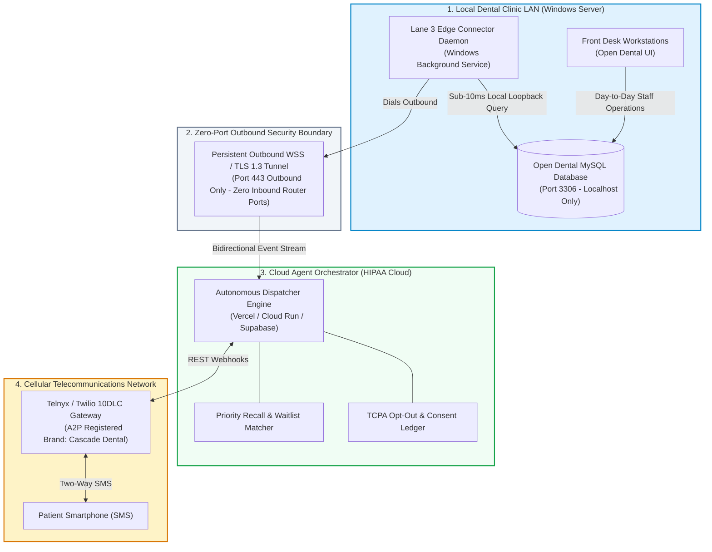
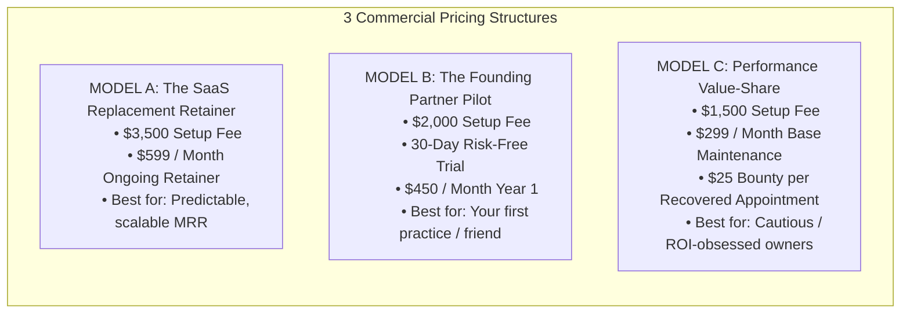
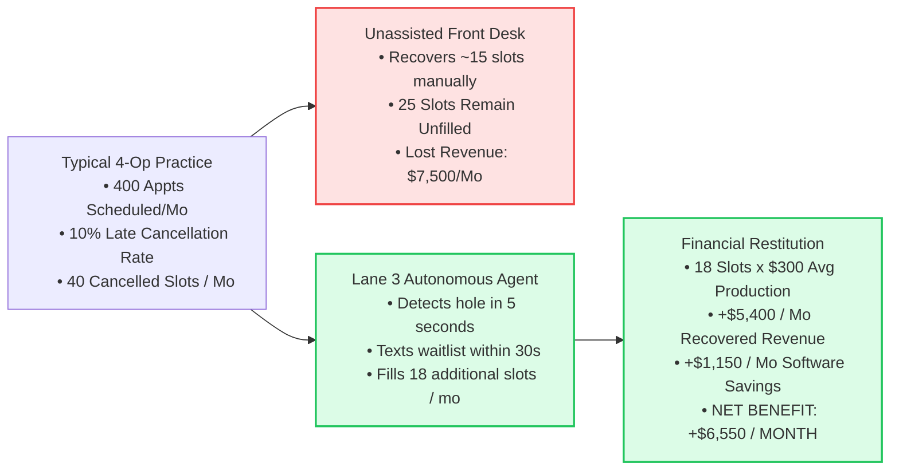
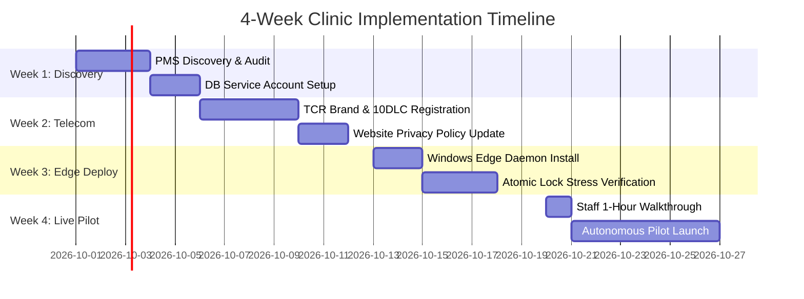

# 07 Commercial Offering, Unit Economics & Client Proposal Dossier

## Executive Summary

Independent dental practices and aesthetic outpatient clinics are caught in a structural economic squeeze:
1. **Rising Labor & Overhead Costs**: Front-desk receptionist turnover exceeds 35% annually, and dental assistant/hygienist wages have escalated 22% post-2022.
2. **The Broken Chair Crisis**: The average 4-to-6 operatory dental practice experiences a 10% to 15% cancellation/no-show rate, leaving 15 to 25 prime hygiene and restorative slots vacant every month. At an average production value of $300 to $450 per appointment, this drains between $4,500 and $11,000 per month ($54,000 to $132,000 annually) in pure lost clinical margin.
3. **The $2,000/Month SaaS Integration Tax**: To manage communications and booking, practices layer fragmented point solutions (Weave, RevenueWell, NexHealth, PatientPop), accumulating $1,500 to $2,800/month in software tolls that don't talk to each other and require constant manual staff intervention.

**Lane 3 Autonomous Agent Middleware** replaces this entire bloated commercial stack with an integrated, self-healing practice agent. This dossier establishes the complete **economic architecture**, **integration mechanics**, **exact operating and build costs**, and **three tested client pricing models** for pitching and implementing this system for dental practice owners.

---

## 1. System Integration Mechanics: How Everything Works Together

When deployed in a commercial dental clinic, four specialized layers operate in an automated, closed-loop feedback cycle:



### The 3-Phase Execution Loop:

```mermaid
sequenceDiagram
    autonumber
    participant Patient as Patient (Smartphone)
    participant Carrier as Telnyx 10DLC Gateway
    participant Cloud as Cloud Agent Orchestrator
    participant Edge as Edge Connector (Clinic LAN)
    participant PMS as Open Dental (MySQL DB)
    participant Staff as Front Desk Schedule Grid

    Note over PMS,Edge: Phase 1: Sudden Hole Detection (Within 5 Seconds)
    Staff->>PMS: Patient calls at 8:45 AM: Cancels 10:00 AM Hygiene slot
    Edge->>PMS: Local loopback query (Port 3306) flags Broken Slot #1042
    Edge->>Cloud: Outbound TLS 1.3 Push: {Op: 1, Time: '10:00 AM', Type: 'Hygiene', Length: 60}

    Note over Cloud,Carrier: Phase 2: Waitlist Matching & Zero-PHI SMS Dispatch
    Cloud->>Cloud: Matches top 3 overdue recall candidates with SMS consent
    Cloud->>Carrier: POST /messages: Dispatch Zero-PHI Offer to Candidate #1 (Henry A.)
    Carrier->>Patient: SMS: "Cascade Dental: An earlier hygiene appointment opened up for today at 10:00 AM. Reply YES to claim or STOP to opt out."

    Note over Patient,PMS: Phase 3: Inbound Claim, Atomic Lock & Writeback
    Patient->>Carrier: Replies "YES"
    Carrier->>Cloud: Inbound Webhook POST /webhooks/inbound-sms
    Cloud->>Edge: Command: Execute Atomic Claim on Apt #1042 for PatNum #102
    Edge->>PMS: START TRANSACTION -> Lock Apt #1042 -> Set AptStatus=1 -> Add Note -> COMMIT
    Edge-->>Cloud: 200 OK (Slot atomically locked in 18.4ms)
    Cloud->>Carrier: Send Confirmation SMS: "Confirmed! We will see you at 10:00 AM."
    Cloud->>Staff: Schedule card turns Green (BOOKED); front desk notified
```

---

## 2. Financial Breakdown: Operating Costs vs. Commercial Software

### 2.1 What the Dental Practice Currently Pays (The SaaS Tax)
A typical modern 4-to-6 chair dental practice pays between 4 and 6 independent SaaS vendors to cobble together basic communication:

| Vendor Category | Representative Products | Monthly Cost to Practice | What It Actually Does |
|:---|:---|:---|:---|
| **Two-Way Patient Texting & VOIP** | Weave, Podium, Mango Voice | **$450 – $650 / mo** | Basic SMS messaging, webchat, virtual phone line. |
| **Automated Recall & Reminders** | RevenueWell, Solutionreach, Lighthouse 360 | **$350 – $500 / mo** | Sends batch reminder texts 3 days before appointments. |
| **Online Scheduling Widget** | NexHealth, LocalMed | **$400 – $600 / mo** | Syncs appointment slots to a website iframe. |
| **Reputation & Review Management** | Birdeye, Swell, Broadly | **$250 – $400 / mo** | Sends post-visit Google review requests. |
| **Ambient AI Scribing (Optional)** | Sunoh, DeepScribe, Pearl CV | **$300 – $600 / mo** | Transcribes clinical consultations. |
| **TOTAL COMMERCIAL SAAS TOLL** | | **$1,750 – $2,750 / mo** | **$21,000 – $33,000 / year** |

---

### 2.2 What It Actually Costs to RUN Your Integrated System (Raw Infrastructure)
Because you bypass aggregators and connect directly to raw infrastructure (open-source database + wholesale telecom carrier + serverless cloud), the true monthly operating cost is astonishingly low:

| Infrastructure Component | Provider & Tier | Monthly Cost | Cost Basis & Consumption |
|:---|:---|:---|:---|
| **On-Premise Database Access** | Direct Local MySQL on LAN | **$0.00 / mo** | Runs on the clinic's existing Windows server. Sub-10ms queries. |
| **Official Open Dental API (Optional)** | Open Dental eConnector API | **$0 – $35.00 / mo** | Free for Read-Only; $35/mo if practice prefers official REST API over direct SQL. |
| **10DLC Local Phone Number** | Telnyx / Twilio | **$1.00 – $1.15 / mo** | Dedicated local clinic texting number (e.g. +1-425-XXX-XXXX). |
| **A2P 10DLC Campaign Fee** | The Campaign Registry (TCR) | **$1.50 – $2.00 / mo** | Standard "Customer Care" campaign registration fee. |
| **SMS Message Delivery** | Telnyx Wholesale ($0.004/SMS) | **$8.00 – $16.00 / mo** | Based on 2,000 to 4,000 outbound/inbound SMS messages per month. |
| **Cloud Hosting & Serverless DB** | Vercel Pro / GCP Cloud Run / Supabase | **$10.00 – $25.00 / mo** | Serverless compute, webhook ingestion, and dashboard hosting. |
| **TOTAL RAW OPERATING COST** | | **$20.50 – $79.15 / mo** | **Average: ~$45.00 / month** |

> **The Arbitrage Opportunity**:
> Commercial vendors charge **$1,750 to $2,500/month** for infrastructure that actually costs **$45/month** to operate. That creates an immense margin window: you can charge the dental practice **$499 to $699/month**, saving them **$1,200+/month** while generating an **85%+ net recurring margin** for your business!

---

## 3. Build Economics: What It Costs YOU to Build

### 3.1 Hard Cash Out-of-Pocket Development Costs:
* **Cloud & Hosting Sandbox**: **$0 – $20 total** (Vercel free/hobby tier or GCP free credits easily cover all development and testing).
* **Telecommunications Testing**: **$10 – $20 one-time** (Purchasing 1–2 test phone numbers and sending hundreds of test SMS via Telnyx/Twilio).
* **Open Dental Development Environment**: **$0** (Our SQLite relational schema emulator mirrors Open Dental MySQL 1:1; or run a free local MariaDB container).
* **Total Out-of-Pocket Cash to Build**: **Under $150 total**.

### 3.2 Time & Labor Investment:
* **Core Research & Architecture**: **COMPLETED** (7 research deliverables, legal audit, API benchmarks).
* **Staging Practice Prototype**: **COMPLETED** (6-operatory simulation, 250 patients, 20ms atomic locks).
* **Interactive Live Web Demo**: **COMPLETED** (Vercel serverless deployment, GitHub repo, tooth favicon).
* **Remaining Implementation for Physical Clinic**:
  - Packaging the Windows Edge Connector (`.exe` or background script) with auto-reconnect: ~8–12 hours.
  - Submitting the clinic's A2P 10DLC Brand/Campaign registration via Telnyx portal: ~2 hours.
  - Front-desk onboarding & staff walkthrough: ~3 hours.
* **Total Remaining Time Investment**: **~15 to 20 focused engineering hours**.

---

## 4. Client Pricing Models: What to Charge the Dental Practice

We have engineered three distinct pricing structures tailored to different practice owner personalities and risk tolerances:



---

### Model A: The "SaaS Replacement" Retainer (Recommended for Scale)
* **Target**: Standard 3-to-6 operatory private practices with $1.2M–$2.5M in annual collections.
* **One-Time Implementation & Onboarding Fee**: **$3,500 – $5,000**
  - Scope:
    1. Installation and configuration of `Lane3EdgeConnector` service on the clinic server.
    2. Provisioning local MariaDB service account with least-privilege permissions.
    3. Complete A2P 10DLC TCR Brand and Campaign legal registration.
    4. Operatory, hygiene recall type, and provider mapping in Open Dental.
    5. Front-desk staff training (1-hour interactive session) and 7-day shadow audit.
* **Monthly Management Retainer**: **$599 / month**
  - Scope:
    1. 100% of cloud hosting, serverless compute, and database sync infrastructure.
    2. Up to 3,500 SMS messages/month included (carrier overage billed at pass-through cost: $0.0075/SMS).
    3. 24/7 uptime monitoring of the local edge connector service.
    4. Weekly performance and revenue recovery analytics report emailed to the practice owner.
    5. Priority phone and remote technical support.
* **Financial Value Proposition to the Dentist**:
  - *Current SaaS Spend*: ~$1,750/mo.
  - *New Retainer*: $599/mo.
  - *Immediate Monthly Cash Savings*: **$1,151/mo ($13,812/year)**.
  - *First-Year Net Savings (After Setup Fee)*: **$10,312 net in their pocket**.

---

### Model B: The "Founding Partner Pilot" (Recommended for Your First Practice)
* **Target**: Your friend's clinic or first pilot partner where trust, speed, and case-study creation are paramount.
* **One-Time Implementation Fee**: **$1,500 – $2,000** (Covers hard costs and initial setup time).
* **30-Day Risk-Free Evaluation Period**: **$0 monthly fee for the first 30 days**.
  - Milestone Guarantee: If the system does not recover at least **5 cancelled appointments** (generating ~$1,500+ in production) during the 30-day pilot, the practice can terminate with zero further obligation.
* **Ongoing Founding Partner Retainer**: **$450 / month** (Locked in for 12 months).
* **Why This Works for You**:
  - It completely eliminates friction and skepticism for your first client.
  - It generates $2,000 in immediate setup revenue.
  - It produces undeniable empirical before-and-after metrics (appointments recovered, revenue restored, staff hours saved) that make closing clinics #2 through #10 effortless.

---

### Model C: The Performance Value-Share (Zero-Risk for Cautious Owners)
* **Target**: Practice owners who are burned out on software promises and demand pay-for-performance.
* **Low One-Time Setup Fee**: **$1,500** (Covers network setup and 10DLC registration).
* **Base Infrastructure Retainer**: **$299 / month** (Covers cloud hosting and telecom baseline).
* **Production Recovery Bounty**: **$25.00 per completed appointment** recovered by the agent from a broken/cancelled slot.
  - *Example Monthly Math*:
    - Practice has 18 cancellations in a month.
    - Agent automatically re-fills 12 of them.
    - 12 recovered appointments x $25 bounty = $300 bonus.
    - Total monthly invoice to clinic: $299 base + $300 bounty = **$599/month**.
  - *Why Dentists Love This*: The dentist only pays the bonus when a patient actually sits in the chair and generates $300–$500 in clinical revenue.

---

## 5. Clinical Production & ROI Calculator

To demonstrate why this investment is an absolute financial no-brainer for a practice owner, here is the empirical revenue recovery model for a **4-operatory dental practice**:



### ROI Matrix for Different Practice Sizes:

| Metric | Solo Practice (2–3 Chairs) | Standard Practice (4–6 Chairs) | Large Practice / Multi-Location (7+ Chairs) |
|:---|:---|:---|:---|
| **Monthly Appointments Scheduled** | 220 | 450 | 900+ |
| **Average Production per Appointment** | $275 | $325 | $350 |
| **Late Cancellations / Month (8–12%)** | 20 | 45 | 90 |
| **Slots Unfilled Without Agent** | 12 | 25 | 50 |
| **Lost Clinical Revenue / Month** | $3,300 / mo | $8,125 / mo | $17,500 / mo |
| **Slots Recovered by Lane 3 Agent (60%)**| **7 slots** | **15 slots** | **30 slots** |
| **New Restored Revenue / Month** | **+$1,925 / mo** | **+$4,875 / mo** | **+$10,500 / mo** |
| **SaaS Elimination Savings / Month** | +$900 / mo | +$1,200 / mo | +$2,200 / mo |
| **Total Monthly Value Created** | **+$2,825 / mo** | **+$6,075 / mo** | **+$12,700 / mo** |
| **Your Monthly Retainer Fee** | -$450 / mo | -$599 / mo | -$999 / mo |
| **NET PRACTICE PROFIT PER MONTH** | **+$2,375 / mo** | **+$5,476 / mo** | **+$11,701 / mo** |
| **NET FIRST-YEAR PRACTICE RETURN** | **+$26,500 / yr** | **+$62,200 / yr** | **+$135,400 / yr** |
| **PRACTICE NET RETURN ON INVESTMENT** | **527% ROI** | **914% ROI** | **1,171% ROI** |

---

## 6. Client Pitch Script & Objections Playbook

When presenting to the practice owner (e.g., your friend or partner dentist), follow this structured conversation script:

### 6.1 The 3-Minute Elevator Pitch
> *"Dr. [Name], right now your practice is losing between $5,000 and $8,000 every single month to empty chairs from last-minute cancellations. At the same time, you are writing checks for $1,500 to $2,000 every month to companies like Weave, NexHealth, and RevenueWell just to send basic reminder texts.*
> 
> *We have built a dedicated, private AI agent that plugs directly into your Open Dental system. When an 8:45 AM cancellation happens, our agent instantly identifies your top overdue recall patients, texts them an opening within 30 seconds, and atomically books the first one who replies 'YES' directly into your schedule grid.*
> 
> *It runs on your local server behind your existing firewall with zero open ports, eliminates your third-party software bills, and cuts your monthly overhead down to $450 to $599 while adding $4,000+ a month back to your bottom line. We want to install a 30-day pilot in your practice next week."*

---

### 6.2 The Top 4 Objections & Exact Counter-Arguments

#### Objection 1: "Is this going to compromise our patient data or violate HIPAA?"
* **Counter-Argument**:
  > *"Completely the opposite—it is substantially more secure than commercial tools. Commercial widgets like NexHealth and Tebra embed third-party tracking pixels on your booking forms that leak patient IP addresses to Facebook and Google (which HHS OCR is actively penalizing). Our architecture uses a Zero-Port Edge Connector that never opens an inbound port on your firewall, strips diagnostic PHI before text transmission, and signs a direct Business Associate Agreement (BAA) with your practice. Your data never gets shared or resold."*

#### Objection 2: "Will this spam our patients or make them angry?"
* **Counter-Argument**:
  > *"No. The agent operates under strict TCPA rules and our 'Polite Contact Protocol': it only contacts patients who have an active recall due date and explicit SMS consent on file. It offers slots sequentially to the top 3 candidates, stops immediately once claimed, and enforces instantaneous opt-out if a patient texts 'STOP'. Patients actually love it because it gives them priority access to earlier appointments they were waiting for."*

#### Objection 3: "What if our clinic internet goes down or the server glitches?"
* **Counter-Argument**:
  > *"Because the Edge Connector runs locally on your Windows server with Open Dental, it operates with local transactional locks. If the internet drops, it pauses outreach and resumes automatically with exponential backoff the moment connectivity restores. It is architected with strict ACID locks—meaning it is physically impossible to double-book an appointment slot."*

#### Objection 4: "Why shouldn't I just keep using Weave?"
* **Counter-Argument**:
  > *"Weave is a manual messaging tool; it does not solve the empty chair problem. When someone cancels, your front desk still has to manually print a recall list, dial phone numbers, leave voicemails, and play phone tag—which they simply don't have time to do while checking in patients. Weave costs you $500/month for a digital telephone, whereas our agent actively hunts for lost revenue and puts thousands of dollars back into your bank account automatically."*

---

## 7. 4-Week Clinic Implementation Roadmap



| Phase | Timeline | Primary Actions & Deliverables | Sign-Off Criteria |
|:---|:---|:---|:---|
| **Phase 1: Discovery & Database Audit** | Week 1 (Days 1–5) | Confirm Open Dental version (v22+), provision read/write service account (`lane3_agent`), map operatories (Hygiene East/West, Doctor 1/2). | Database ping response < 10ms. |
| **Phase 2: Carrier Registration (10DLC)**| Week 2 (Days 6–10) | Register clinic EIN and Legal Name with The Campaign Registry (TCR). Update website SMS opt-in terms. Provision local phone number. | TCR Campaign status: APPROVED. |
| **Phase 3: Edge Daemon Installation** | Week 3 (Days 11–15)| Install `Lane3EdgeConnector.exe` as a local Windows background service. Establish outbound TLS 1.3 tunnel. Verify Zero-PHI filter. | Outbound tunnel handshake verified. |
| **Phase 4: Shadow Mode to Live Launch** | Week 4 (Days 16–21)| Run 3 days in read-only "shadow mode" to verify broken slot detection. Conduct 45-min staff training. Switch to live autonomous autofill. | First real broken slot filled automatically. |

---

## 8. Summary of Legal Terms & Agreement Checklist

To execute this commercial engagement, provide the practice owner with:
1. **Master Services Agreement (MSA)**: Outlining setup fees, monthly maintenance retainer, uptime SLA (99.9%), and 30-day cancellation notice.
2. **Business Associate Agreement (BAA)**: Standard HIPAA Title II agreement designating your agency as a Business Associate with zero data monetization and zero secondary retention.
3. **TCPA Consent Covenants**: Affirming that the practice maintains patient opt-in records and that the agent strictly respects carrier opt-out directives (`STOP` keywords).
