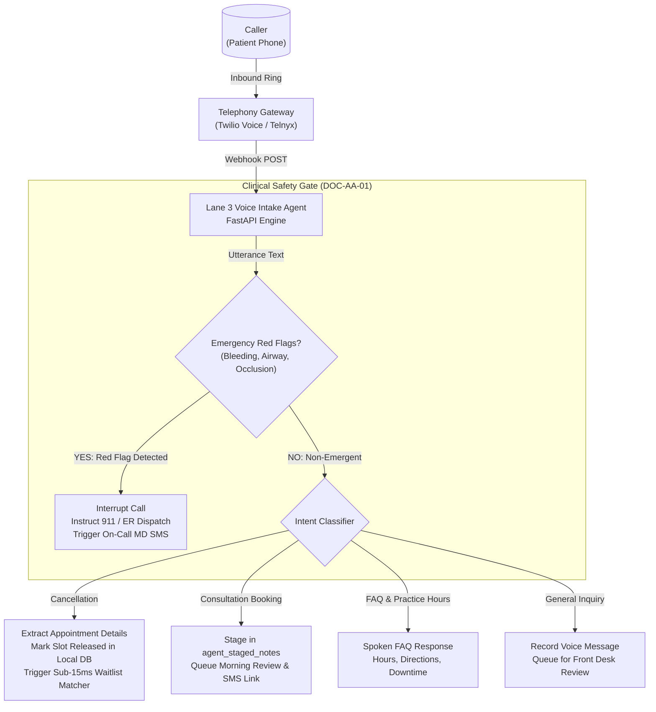

# Lane 3 After-Hours Conversational Voice Intake Agent

An autonomous inbound telephone triage and appointment recovery daemon engineered for outpatient dental and aesthetic medicine practices.

---

## 1. System Overview & Architecture

The Voice Intake Agent provides automated, 24/7 telephone reception over **Twilio Voice** (TwiML XML `<Gather>` / `<Say>`) and **Telnyx Voice** (Call Control API). 

It bridges after-hours phone calls directly to the practice's local schedule, extracting short-notice cancellations to trigger instant waitlist fill sequences while strictly adhering to clinical safety boundaries (**DOC-AA-01**).



---

## 2. DOC-AA-01 Clinical Safety Protocol

Under standard **DOC-AA-01 (Agent Authority & Medical Safeguards)**:
- **Zero Autonomous Medical Diagnosis**: The Voice Agent never attempts to diagnose conditions or recommend drug dosages.
- **Immediate Emergency Escalation**: The moment speech recognition detects acute red-flag terms, the agent immediately halts conversation, provides mandatory emergency referral language, alerts the clinic's on-call clinical director, and terminates the call.

### Red-Flag Clinical Patterns Monitored:
1. **Uncontrolled Hemorrhage**: `bleeding heavily`, `gushing`, `mouth full of blood`, `can't stop bleeding`.
2. **Airway & Respiratory Compromise**: `can't breathe`, `throat closing`, `trouble swallowing`, `choking`.
3. **Aesthetic Vascular Occlusion**: `skin turned white`, `blanching`, `gray skin`, `severe pain after filler`, `vision changes`.
4. **Severe Facial / Dental Trauma**: `knocked out tooth`, `broken jaw`, `fractured facial bone`.
5. **Systemic Crisis**: `chest pain`, `loss of consciousness`, `anaphylaxis`, `fever > 102F`.

---

## 3. Webhook Endpoints & API Contract

### Inbound Twilio Webhook
- **Method**: `POST`
- **Route**: `/voice/twilio/inbound`
- **Payload**: Standard Twilio Form Data (`CallSid`, `From`, `To`, `CallStatus`)
- **Response**: TwiML XML with greeting, emergency disclaimer, and `<Gather>` tag using neural voice `Polly.Joanna-Neural`.

### Twilio Gather Action Webhook
- **Method**: `POST`
- **Route**: `/voice/twilio/gather?call_sid={call_sid}`
- **Payload**: `SpeechResult` (caller speech transcript) or `Digits` (DTMF keypad input)
- **Response**: Dynamic TwiML XML executing the classified intent.

### Telnyx Inbound Webhook
- **Method**: `POST`
- **Route**: `/voice/telnyx/inbound`
- **Payload**: JSON Event Object (`event_type: call.initiated`, `call_control_id`)
- **Response**: JSON Command Object (`command: speak` or `gather_using_audio`).

---

## 4. Database Schema (SQLite / Edge Mirror)

```sql
-- Call Session History
CREATE TABLE voice_call_logs (
    call_sid TEXT PRIMARY KEY,
    caller_phone TEXT,
    practice_id TEXT,
    intent TEXT,
    triage_level TEXT,
    transcript TEXT,
    entities_json TEXT,
    created_at TIMESTAMP DEFAULT CURRENT_TIMESTAMP
);

-- Staged Consultations for Front-Desk Review
CREATE TABLE agent_staged_notes (
    id INTEGER PRIMARY KEY AUTOINCREMENT,
    call_sid TEXT,
    caller_phone TEXT,
    patient_name TEXT,
    procedure_requested TEXT,
    preferred_window TEXT,
    notes TEXT,
    status TEXT DEFAULT 'PENDING_STAFF_REVIEW',
    created_at TIMESTAMP DEFAULT CURRENT_TIMESTAMP
);

-- Extracted Cancellations Triggering Waitlist Autofill
CREATE TABLE appointment_cancellations (
    id INTEGER PRIMARY KEY AUTOINCREMENT,
    call_sid TEXT,
    caller_phone TEXT,
    patient_name TEXT,
    appointment_date TEXT,
    procedure_type TEXT,
    reason TEXT,
    waitlist_triggered INTEGER DEFAULT 1,
    created_at TIMESTAMP DEFAULT CURRENT_TIMESTAMP
);
```

---

## 5. Deployment & Configuration

### Environment Variables (`.env.voice`):
```env
VOICE_SERVER_PORT=8080
CARRIER_PROVIDER=twilio # or telnyx
TWILIO_ACCOUNT_SID=AC_YOUR_ACCOUNT_SID
TWILIO_AUTH_TOKEN=your_auth_token
ON_CALL_DOCTOR_PHONE=+12065550199
LOCAL_DB_PATH=c:/lane3/data/clinic.db
```

### Running the Voice Daemon:
```bash
# Direct execution using Uvicorn
uvicorn voice_agent.telephony_voice:create_voice_app --factory --host 0.0.0.0 --port 8080
```
